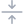
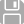
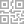

# wuijs-lib

Versión librería: `0.2.0`

Versión documentación: `0.2.0-1e`

Licencia: `Licencia Apache 2.0`

Autor: `Sergio E. Belmar V. <sbelmar@1640lab.com>`

## Índice

*   [Description General](#overview)
	*   [Tabla de Clases](#classes-table)
*   [Instalación](#install)
*   [Implementación](#implementation)
*   [Clases](#classes)
	*   [WUICookie](#wuiCookie)
	*   [WUIHead](#wuiHead)
	*   [WUIBody](#wuiBody)
	*   [WUILanguage](#wuiLanguage)
	*   [WUIScrolly](#wuiScrolly)
	*   [WUIIcon](#wuiIcon)
	*   [WUIFade](#wuiFade)

<a name="overview"></a>

## Description General

WUI, acrónimo del inglés *Web User Interface JavaScript library*, es una biblioteca JS de código abierto orientada a la implementación rápida de intetfaces de usuario Web compuesta por 25 clases, las que pueden ser utilizadas de manera independiente o conjunta.

<a name="classes-table"></a>

### Tabla de Clases

| Class            | Version | Descripción |
| ---------------- | -------:| ----------- |
| WUICookie        | `0.1`   | Administrador de cookies. |
| WUIHead          | `0.1`   | Administrador de cabecera HTML. |
| WUIBody          | `0.1`   | Administrador de cuerpo HTML. Permite la importación de contenido CSS/JS/HTML y facilita la implementación en entornos nativos móviles. |
| WUILanguage      | `0.2`   | Administrador de idioma para interfaces web. Permite cargar archivos de idioma en formato JS o JSON y actualizar dinámicamente el contenido de los elementos HTML según el idioma. |
| WUIScrolly       | `0.1`   | Herramienta para animación de elementos HTML mediante el evento "onscroll" del cuerpo de la página HTML. |
| WUIIcon          | `0.1`   | Conjunto de íconos prediseñados y carga mediante CSS, para uso en interfaces. |
| WUIFade          | `0.1`   | Herramienta para salida y entrada con opacidad (fade-out y fade-in respectivamente) de elementos HTML. |
| WUITooltip       | `0.1`   | Objeto simple para texto emergente. |
| WUILoader        | `0.1`   | Objeto simple para animación de carga. |
| WUIModal         | `0.1`   | Objeto compuesto para implementación de cuadros de diálogo (tipo `message`) y ventanas emergentes (tipo `page`). |
| WUIModalSelector | `0.1`   | Objeto extendido de `WUIModal` para la implementación de listas de selección en base a arreglos o a entradas de datos de tipo `<select>`. |
| WUISlider        | `0.1`   | Objeto compuesto para implementación de persianas controladas por ratón y/o por evento. |
| WUIPaging        | `0.1`   | Objeto compuesto para implementación de vistas accesibles paginadamente. |
| WUITabs          | `0.1`   | Objeto compuesto para implementación de vistas accesibles mediante selección por pestaña. |
| WUIList          | `0.1`   | Objeto compuesto para implementación de listas de datos y botoneras para cada fila de manera opcional. |
| WUITable         | `0.1`   | Objeto compuesto para implementación de tablas de datos. A diferencia del objeto `WUIList`, el objeto `WUITable` incluye una cabecera de columnas. |
| WUIForm          | `0.1`   | Objeto compuesto para implementación de formularios de datos. Este objeto permite la implementación de elementos HTML de entrada de datos tales como `<input>`, `<select>` y `<textarea>` y objetos de la librería WUI como `WUISelectpicker`, `WUIDatepicker`, `WUITimepicker`, `WUIColorpicker`, `WUICheckbox`, `WUIIntensity` y `WUIButton`. |
| WUIFormat        | `0.1`   | Herramienta para manejo y validación de formatos de datos de tipo `string`, `number` y `Date`. |
| WUISelectpicker  | `0.1`   | Objeto compuesto para implementación de entradas de datos de selección múltiple o excluyente en base a listas en base a elementos HTML `<select>`. |
| WUIDatepicker    | `0.1`   | Objeto compuesto para implementación de entradas de datos de tipo fecha. |
| WUITimepicker    | `0.1`   | Objeto compuesto para implementación de entradas de datos de tipo hora. |
| WUIColorpicker   | `0.1`   | Objeto compuesto para implementación de entradas de datos de tipo selector de color. |
| WUICheckbox      | `0.1`   | Objeto compuesto para implementación de entradas de datos de tipo casilla de verificación. |
| WUIIntensity     | `0.1`   | Objeto compuesto para implementación de entradas de datos de tipo selector de intensidad de 4 niveles: nada, bajo, medio y alto. |
| WUIButton        | `0.1`   | Objeto compuesto para implementación de botones. |

<a name="install"></a>

## Instalación

Para instalar la biblioteca WUI, debe clonarla desde los repositorios oficiales de distribución en GitHib (`1640lab/wuijs-lib` o `sbelmar/wuijs-lib`). Suponiendo que el proyecto donde se implementará tenga un directorio de descargas: `./downloads`, un directorio de código fuente `./src` y, dentro de este, un directorio de bibliotecas `./src/Libraries`, debe escribir lo siguiente en la terminal:

```bash
cd ./downloads
git clone https://git@github.com/1640lab/wuijs-lib.git
cp -r ./wuijs-lib/src/WDS ../src/Libraries/
```

<a name="implementation"></a>

## Implementación

Para habilitar todas las clases se deben implementar las dependencias CSS y JS de las librerías en la cabecera HTML de la página web conjuntamente con los archivos de configuración de estilos `Settings.css` y `WUI.css`.

Código CSS archivo `Settings.css`:

```css
/* Main settings */

:root {
	--app-light1color: #f6f6fa;
	--app-light2color: #fdfdfe;
	--app-dark1color: #3b404a;
	--app-dark2color: #353a40;
	--app-dark3color: #1f2429;
	--app-dark4color: #3c4d5a;
	--app-dark5color: #2f3c48;
	--app-primarycolor: #f4a261;
	--app-hightlightcolor: #1e90ff;
	--app-warningcolor: #f44343;
	--app-disabledcolor: #d5dce3;
	--app-softcolor: #353a401a;
	--app-titlefont: "SanFrancisco";
}
```

Código CSS archivo `WUI.css`:

```css
/* WUI settings */

:root {

	/* wui-loader */

	--wui-loader-color: var(--app-light1color);

	/* wui-scrolly */

	--wui-scrolly-paging-bgcolor: var(--app-light1color);

	/* wui-icon */

	--wui-icon-size: 24px;
	--wui-icon-smallsize: 14px;
	--wui-icon-bgcolor-out: rgb(from var(--app-dark5color) r g b / 70%);
	--wui-icon-bgcolor-over: var(--app-dark5color);

	/* wui-tooltip */

	--wui-tooltip-open-delay: .2s;
	--wui-tooltip-bgcolor: var(--app-dark3color);
	--wui-tooltip-textcolor: #fff;

	/* wui-modal */

	--max-modal-width: 380px;
	--wui-modal-bgcolor: rgba(1, 2, 3, .2); /* rgba required */
	--wui-modal-bgcolor-under: rgba(1, 2, 3, 0);
	--wui-modal-box-radius: 17px;
	--wui-modal-box-bgcolor: rgb(from var(--app-light1color) r g b / 95%);
	--wui-modal-back-textcolor: var(--app-hightlightcolor);
	--wui-modal-topbar-height: 4px;
	--wui-modal-title-textfont: var(--app-titlefont);
	--wui-modal-title-textcase: none;
	--wui-modal-title-textcolor: #000;
	--wui-modal-body-scroll-bgcolor-out: rgb(from var(--app-dark5color) r g b / 20%);
	--wui-modal-body-scroll-bgcolor-over: rgb(from var(--app-dark5color) r g b / 40%);
	--wui-modal-footer-bordercolor: transparent;
	--wui-modal-message-box-width: 280px;
	--wui-modal-message-box-bgcolor: rgba(255, 255, 255, .8);
	--wui-modal-message-box-textcolor: var(--app-dark4color);
	--wui-modal-message-mobile-box-width: 280px;
	--wui-modal-message-mobile-footer-bordercolor: var(--app-softcolor);
	--wui-modal-message-mobile-button-bordercolor: var(--app-softcolor);
	--wui-modal-message-linkcolor: var(--app-hightlightcolor);
	--wui-modal-page-box-width: 800px;
	--wui-modal-page-box-height: 90%;
	--wui-modal-page-box-radius: 10px;
	--wui-modal-page-box-maxheight: 640px;
	--wui-modal-page-box-bgcolor: rgb(from var(--app-light1color) r g b / 95%);
	--wui-modal-page-header-topbar-bgcolor: rgb(from var(--app-dark1color) r g b / 20%);
	--wui-modal-page-header-bordercolor: var(--app-softcolor);
	--wui-modal-slidepage-box-margin: 10px;
	--wui-modal-smallpage-box-width: 340px;
	--wui-modal-smallpage-box-height: 280px;
	--max-modal-mobile-width: 430px;

	/* wui-modal select */

	--wui-modal-select-box-width: 280px;
	--wui-modal-select-box-bgcolor: rgba(255, 255, 255, .8);
	--wui-modal-select-option-bordercolor-out: var(--app-softcolor);
	--wui-modal-select-option-bordercolor-over: var(--app-softcolor);
	--wui-modal-select-option-bgcolor-out: transparent;
	--wui-modal-select-option-bgcolor-over: rgb(from var(--app-dark1color) r g b / 4%);
	--wui-modal-select-option-iconcolor-out: var(--app-hightlightcolor);
	--wui-modal-select-option-iconcolor-over: var(--app-hightlightcolor);
	--wui-modal-select-option-iconcolor-disabled: rgb(112, 128, 144, .4);
	--wui-modal-select-option-textcolor-out: var(--app-dark4color);
	--wui-modal-select-option-textcolor-over: var(--app-hightlightcolor);
	--wui-modal-select-option-textcolor-selected: var(--app-hightlightcolor);
	--wui-modal-select-option-textcolor-disabled: rgb(112, 128, 144, .4);
	--wui-modal-select-option-checker-bordercolor-out: var(--app-hightlightcolor);
	--wui-modal-select-option-checker-bordercolor-selected: var(--app-hightlightcolor);
	--wui-modal-select-option-checker-bgcolor-out: transparent;
	--wui-modal-select-option-checker-bgcolor-selected: var(--app-hightlightcolor);
	--wui-modal-select-button-bordercolor: var(--app-softcolor);

	/* wui-paging */

	--wui-paging-page-transition-time: .4s;
	--wui-paging-page-bgcolor: transparent;
	--wui-paging-page-scroll-bgcolor-out: rgb(from var(--app-dark4color) r g b / 20%);
	--wui-paging-page-scroll-bgcolor-over: rgb(from var(--app-dark4color) r g b / 40%);

	/* wui-tabs */

	--wui-tabs-tab-bgcolor-out: var(--app-light2color);
	--wui-tabs-tab-bgcolor-over: var(--app-light1color);
	--wui-tabs-tab-iconcolor-out: var(--app-hightlightcolor);
	--wui-tabs-tab-iconcolor-over: var(--app-hightlightcolor);
	--wui-tabs-tab-iconcolor-mobile: var(--app-hightlightcolor);
	--wui-tabs-tab-textcolor-out: var(--app-dark4color);
	--wui-tabs-tab-textcolor-over: var(--app-hightlightcolor);

	/* wui-list */

	--wui-list-radius: 10px;
	--wui-list-borderwidth: 0;
	--wui-list-bordercolor: var(--app-softcolor);
	--wui-list-scroll-bgcolor-out: rgb(from var(--app-dark4color) r g b / 20%);
	--wui-list-scroll-bgcolor-over: rgb(from var(--app-dark4color) r g b / 40%);
	--wui-list-row-height: 44px;
	--wui-list-row-borderwidth: 1px;
	--wui-list-row-bordercolor-out: var(--app-softcolor);
	--wui-list-row-bordercolor-over: var(--app-softcolor);
	--wui-list-row-bgcolor-out: var(--app-light2color);
	--wui-list-row-bgcolor-over: var(--app-light1color);
	--wui-list-row-textcolor-out: var(--app-dark4color);
	--wui-list-row-textcolor-over: var(--app-dark4color);
	--wui-list-row-textcolor-disabled: var(--app-disabledcolor);
	--wui-list-innerrow-borderwidth: 1px;
	--wui-list-innerrow-bordercolor: rgb(from var(--app-dark2color) r g b / 10%);
	--wui-list-innerrow-bgcolor: var(--app-light1color);
	--wui-list-innerrow-textcolor: rgb(from var(--app-dark4color) r g b / 60%);
	--wui-list-buttons-bgcolor: transparent;
	--wui-list-button-size: 48px; /* 34px */
	--wui-list-button-hmargin: 8px;
	--wui-list-button-radius: 50%;
	--wui-list-button-bgcolor-enabled: var(--app-hightlightcolor);
	--wui-list-button-bgcolor-disabled: var(--app-disabledcolor);
	--wui-list-message-textcolor: var(--app-dark4color);
	--max-list-width: 600px;
	--max-list-mobile-width: 430px;

	/* wui-table */

	--wui-table-column-bordercolor-width: 1px;
	--wui-table-column-bordercolor-out: rgb(from var(--app-hightlightcolor) r g b / 10%);
	--wui-table-column-bordercolor-over: rgba(255, 255, 255, .8);
	--wui-table-column-bordercolor-selected: rgba(255, 255, 255, .8);
	--wui-table-column-bgcolor-out: transparent;
	--wui-table-column-bgcolor-over: transparent;
	--wui-table-column-bgcolor-selectd: var(--app-hightlightcolor);
	--wui-table-column-textcolor-out: #444;
	--wui-table-column-textcolor-over: #000;
	--wui-table-column-textcolor-disabled: var(--app-disabledcolor);
	--wui-table-row-radius: 10px;
	--wui-table-row-bordercolor-width: 1px;
	--wui-table-row-bordercolor-out: rgb(from var(--app-hightlightcolor) r g b / 10%);
	--wui-table-row-bordercolor-over: rgba(255, 255, 255, .8);
	--wui-table-row-bordercolor-selected: rgba(255, 255, 255, .8);
	--wui-table-row-bgcolor-out: transparent;
	--wui-table-row-bgcolor-over: transparent;
	--wui-table-row-bgcolor-selectd: var(--app-hightlightcolor);
	--wui-table-row-textcolor-out: var(--app-dark1color);
	--wui-table-row-textcolor-over: var(--app-dark3color);
	--wui-table-row-textcolor-disabled: var(--app-disabledcolor);
	--wui-table-row-textcolor-selected: #fff;

	/* wui-slider */

	--wui-slider-dots-bgcolor: transparent;
	--wui-slider-dot-bgcolor: rgba(255, 255, 255, .6);
	--wui-slider-dot-bgcolor-elected: rgba(255, 255, 255, .9);

	/* wui-form */

	--wui-form-header-bordercolor: var(--app-softcolor);
	--wui-form-body-scroll-bgcolor-out: rgb(from var(--app-dark5color) r g b / 20%);
	--wui-form-body-scroll-bgcolor-over: rgb(from var(--app-dark5color) r g b / 40%);
	--wui-form-line-bgcolor: rgba(204, 204, 204, .4);
	--wui-form-fieldset-bgcolor: #fff;
	--wui-form-legend-texttransform: uppercase;
	--wui-form-legend-textcolor: rgb(from var(--app-dark4color) r g b / 60%);
	--wui-form-label-textcolor-out: var(--app-dark4color);
	--wui-form-label-textcolor-focus: var(--app-hightlightcolor);
	--wui-form-label-textcolor-notempty: rgb(from var(--app-dark4color) r g b / 40%);
	--wui-form-label-textcolor-disabled: var(--app-disabledcolor);
	--wui-form-input-height: 30px;
	--wui-form-input-borderwidth: 1px;
	--wui-form-input-borderradius: 15px;
	--wui-form-input-bordercolor-out: rgb(from var(--app-hightlightcolor) r g b / 20%);
	--wui-form-input-bordercolor-focus: var(--app-hightlightcolor);
	--wui-form-input-bordercolor-invalid: var(--app-warningcolor);
	--wui-form-input-bordercolor-disabled: var(--app-disabledcolor);
	--wui-form-input-bgcolor-out: rgb(from var(--app-hightlightcolor) r g b / 4%);
	--wui-form-input-bgcolor-focus: rgb(from var(--app-hightlightcolor) r g b / 4%);
	--wui-form-input-bgcolor-disabled: var(--app-disabledcolor);
	--wui-form-input-textcolor-out: #000;
	--wui-form-input-textcolor-disabled: var(--app-disabledcolor);
	--wui-form-date-openicon-src: none;
	--wui-form-date-openicon-size: 30px;
	--wui-form-date-opencolor-out: #000;
	--wui-form-date-opencolor-over: var(--app-hightlightcolor);
	--wui-form-date-opencolor-focus: var(--app-hightlightcolor);
	--wui-form-date-opencolor-disabled: var(--app-disabledcolor);
	--wui-form-time-openicon-src: none;
	--wui-form-time-openicon-size: 30px;
	--wui-form-time-opencolor-out: #000;
	--wui-form-time-opencolor-over: var(--app-hightlightcolor);
	--wui-form-time-opencolor-focus: var(--app-hightlightcolor);
	--wui-form-time-opencolor-disabled: var(--app-disabledcolor);
	--wui-form-time-textcolor-out: var(--app-hightlightcolor);
	--wui-form-time-textcolor-disabled: var(--app-disabledcolor);
	--wui-form-range-thumb-size: 20px;
	--wui-form-range-thumb-bgcolor-out: var(--app-hightlightcolor);
	--wui-form-range-thumb-bgcolor-over: var(--app-hightlightcolor);
	--wui-form-range-thumb-bgcolor-disabled: var(--app-disabledcolor);
	--wui-form-range-trackbar-height: 7px;
	--wui-form-range-trackbar-borderwidth: 1px;
	--wui-form-range-trackbar-bordercolor: var(--app-softcolor);
	--wui-form-range-trackbar-bgcolor-out: rgb(from var(--app-dark1color) r g b / 4%);
	--wui-form-range-trackbar-bgcolor-over: var(--app-hightlightcolor);
	--wui-form-range-trackbar-bgcolor-disabled: var(--app-disabledcolor);
	--wui-form-select-openicon-src: none;
	--wui-form-select-openicon-size: 30px;
	--wui-form-select-opencolor-out: #000;
	--wui-form-select-opencolor-over: var(--app-hightlightcolor);
	--wui-form-select-opencolor-focus: var(--app-hightlightcolor);
	--wui-form-select-opencolor-disabled: var(--app-disabledcolor);
	--wui-form-data-textcolor-out: var(--app-hightlightcolor);
	--wui-form-data-textcolor-disabled: var(--app-disabledcolor);
	--wui-form-progress-borderwidth: 1px;
	--wui-form-progress-bordercolor: rgb(from var(--app-hightlightcolor) r g b / 20%);
	--wui-form-progress-valuecolor: var(--app-hightlightcolor);
	--wui-form-progress-bgcolor: var(--app-softcolor);
	--wui-form-text-textcolor-out: #888;
	--wui-form-text-textcolor-disabled: var(--app-disabledcolor);
	--wui-form-text-linkcolor-out: var(--app-hightlightcolor);
	--wui-form-text-linkcolor-highlight: var(--app-hightlightcolor);
	--wui-form-message-bgcolor: rgba(255, 255, 255, .6);
	--wui-form-message-textcolor: #888;
	--wui-form-message-highlight-bgcolor: var(--app-hightlightcolor);
	--wui-form-message-highlight-textcolor: #fff;
	--wui-form-mobile-field-bordercolor: rgb(from var(--app-hightlightcolor) r g b / 10%);
	--wui-form-mobile-label-textcolor: #444;
	--wui-form-mobile-input-height: 40px;
	--wui-form-mobile-input-bgcolor: rgb(from var(--app-hightlightcolor) r g b / 4%);
	--wui-form-mobile-input-height: 34px;
	--wui-form-mobile-input-borderradius: 17px;

	/* wui-selectpicker */

	--wui-selectpicker-openicon-src: none;
	--wui-selectpicker-openicon-size: var(--wui-form-select-openicon-src);
	--wui-selectpicker-opencolor-out: var(--wui-form-select-opencolor-out);
	--wui-selectpicker-opencolor-over: var(--wui-form-select-opencolor-over);
	--wui-selectpicker-opencolor-focus: var(--wui-form-select-opencolor-focus);
	--wui-selectpicker-opencolor-disabled: var(--wui-form-select-opencolor-disabled);
	--wui-selectpicker-input-textcolor-out: var(--wui-form-input-textcolor-out);
	--wui-selectpicker-input-textcolor-over: var(--wui-form-input-textcolor-over);
	--wui-selectpicker-input-textcolor-disabled: var(--wui-form-input-textcolor-disabled);
	--wui-selectpicker-box-radius: 10px;
	--wui-selectpicker-box-bordercolor: var(--app-softcolor);
	--wui-selectpicker-box-bgcolor: rgba(255, 255, 255, .8);
	--wui-selectpicker-box-option-bordercolor-out: var(--app-softcolor);
	--wui-selectpicker-box-option-bordercolor-over: var(--app-softcolor);
	--wui-selectpicker-box-option-bgcolor-out: transparent;
	--wui-selectpicker-box-option-bgcolor-over: rgb(from var(--app-dark4color) r g b / 4%);
	--wui-selectpicker-box-option-checkicon-src: none;
	--wui-selectpicker-box-option-checkcolor-out: var(--app-hightlightcolor);
	--wui-selectpicker-box-option-checkcolor-over: var(--app-hightlightcolor);
	--wui-selectpicker-box-option-checkcolor-selected: var(--app-hightlightcolor);
	--wui-selectpicker-box-option-checkcolor-disabled: rgb(112, 128, 144, .4);
	--wui-selectpicker-box-option-textcolor-out: var(--app-dark4color);
	--wui-selectpicker-box-option-textcolor-empty: rgb(from var(--app-dark4color) r g b / 60%);
	--wui-selectpicker-box-option-textcolor-over: var(--app-dark4color);
	--wui-selectpicker-box-option-textcolor-selected: var(--app-hightlightcolor);
	--wui-selectpicker-box-option-textcolor-disabled: rgb(112, 128, 144, .4);
	--wui-selectpicker-box-button-bordercolor: var(--app-softcolor);
	--wui-selectpicker-box-button-textcolor-out: var(--app-hightlightcolor);
	--wui-selectpicker-box-button-textcolor-over: var(--app-hightlightcolor);
	--wui-selectpicker-mobile-bgcolor: rgba(1, 2, 3, .2);
	--wui-selectpicker-mobile-box-width: var(--wui-modal-select-box-width);
	--wui-selectpicker-mobile-box-radius: var(--wui-modal-box-radius);

	/* wui-datepicker */

	--wui-datepicker-openicon-src: none;
	--wui-datepicker-openicon-size: var(--wui-form-select-openicon-src);
	--wui-datepicker-opencolor-out: var(--wui-form-select-opencolor-out);
	--wui-datepicker-opencolor-over: var(--wui-form-select-opencolor-over);
	--wui-datepicker-opencolor-focus: var(--wui-form-select-opencolor-focus);
	--wui-datepicker-opencolor-disabled: var(--wui-form-select-opencolor-disabled);
	--wui-datepicker-box-radius: 10px;
	--wui-datepicker-box-bordercolor: var(--app-softcolor);
	--wui-datepicker-box-bgcolor: rgba(255, 255, 255, .8);
	--wui-datepicker-box-upicon-src: none;
	--wui-datepicker-box-upcolor-out: #000;
	--wui-datepicker-box-upcolor-over: var(--app-hightlightcolor);
	--wui-datepicker-box-upcolor-disabled: var(--app-disabledcolor);
	--wui-datepicker-box-downicon-src: none;
	--wui-datepicker-box-downcolor-out: #000;
	--wui-datepicker-box-downcolor-over: var(--app-hightlightcolor);
	--wui-datepicker-box-downcolor-disabled: var(--app-disabledcolor);
	--wui-datepicker-box-previcon-src: none;
	--wui-datepicker-box-prevcolor-out: var(--app-hightlightcolor);
	--wui-datepicker-box-prevcolor-over: var(--app-hightlightcolor);
	--wui-datepicker-box-prevcolor-disabled: var(--app-disabledcolor);
	--wui-datepicker-box-nexticon-src: none;
	--wui-datepicker-box-nextcolor-out: var(--app-hightlightcolor);
	--wui-datepicker-box-nextcolor-over: var(--app-hightlightcolor);
	--wui-datepicker-box-nextcolor-disabled: var(--app-disabledcolor);
	--wui-datepicker-box-month-titlecolor: #888;
	--wui-datepicker-box-month-bgcolor-today: var(--app-softcolor);
	--wui-datepicker-box-month-bgcolor-over: rgb(from var(--app-hightlightcolor) r g b / 20%);
	--wui-datepicker-box-month-bgcolor-selected: var(--app-hightlightcolor);
	--wui-datepicker-box-month-textcolor-out: #000;
	--wui-datepicker-box-month-textcolor-over: var(--app-hightlightcolor);
	--wui-datepicker-box-month-textcolor-selected: #fff;
	--wui-datepicker-box-day-bgcolor-today: var(--app-softcolor);
	--wui-datepicker-box-day-bgcolor-over: rgb(from var(--app-hightlightcolor) r g b / 20%);
	--wui-datepicker-box-day-bgcolor-selected: var(--app-hightlightcolor);
	--wui-datepicker-box-day-textcolor-out: #000;
	--wui-datepicker-box-day-textcolor-over: var(--app-hightlightcolor);
	--wui-datepicker-box-day-textcolor-selected: #fff;
	--wui-datepicker-box-button-textcolor-out: var(--app-hightlightcolor);
	--wui-datepicker-box-button-textcolor-over: var(--app-hightlightcolor);
	--wui-datepicker-mobile-bgcolor: rgba(1, 2, 3, .2);

	/* wui-timepicker */

	--wui-timepicker-openicon-src: none;
	--wui-timepicker-openicon-size: var(--wui-form-select-openicon-src);
	--wui-timepicker-opencolor-out: var(--wui-form-select-opencolor-out);
	--wui-timepicker-opencolor-over: var(--wui-form-select-opencolor-over);
	--wui-timepicker-opencolor-focus: var(--wui-form-select-opencolor-focus);
	--wui-timepicker-opencolor-disabled: var(--wui-form-select-opencolor-disabled);
	--wui-timepicker-box-radius: 10px;
	--wui-timepicker-box-bordercolor: var(--app-softcolor);
	--wui-timepicker-box-bgcolor: rgba(255, 255, 255, .8);
	--wui-timepicker-box-option-bgcolor-now: var(--app-softcolor);
	--wui-timepicker-box-option-bgcolor-over: rgb(from var(--app-hightlightcolor) r g b / 20%);
	--wui-timepicker-box-option-bgcolor-selected: var(--app-hightlightcolor);
	--wui-timepicker-box-option-textcolor-out: #000;
	--wui-timepicker-box-option-textcolor-over: var(--app-hightlightcolor);
	--wui-timepicker-box-option-textcolor-selected: #fff;
	--wui-timepicker-box-button-textcolor-out: var(--app-hightlightcolor);
	--wui-timepicker-box-button-textcolor-over: var(--app-hightlightcolor);
	--wui-timepicker-mobile-bgcolor: rgba(1, 2, 3, .2);

	/* wui-colorpicker */

	--wui-colorpicker-button-size: 30px;
	--wui-colorpicker-button-bordercolor-out: rgb(from var(--app-hightlightcolor) r g b / 20%);
	--wui-colorpicker-button-bordercolor-over: var(--app-hightlightcolor);
	--wui-colorpicker-button-bordercolor-invalid: var(--app-warningcolor);
	--wui-colorpicker-button-bordercolor-disabled: var(--app-disabledcolor);
	--wui-colorpicker-button-bgcolor-out: transparent;
	--wui-colorpicker-button-bgcolor-over: transparent;
	--wui-colorpicker-button-bgcolor-disabled: transparent;
	--wui-colorpicker-viewicon-borderwidth: 1px;
	--wui-colorpicker-viewicon-bordercolor: rgb(from var(--app-hightlightcolor) r g b / 20%);
	--wui-colorpicker-openicon-src: none;
	--wui-colorpicker-openicon-size: var(--wui-form-select-pickericon-size);
	--wui-colorpicker-opencolor-out: var(--wui-form-select-opencolor-out);
	--wui-colorpicker-opencolor-over: var(--wui-form-select-opencolor-over);
	--wui-colorpicker-opencolor-focus: var(--wui-form-select-opencolor-focus);
	--wui-colorpicker-opencolor-disabled: var(--wui-form-select-opencolor-disabled);
	--wui-colorpicker-emptyicon-src: none;
	--wui-colorpicker-emptycolor-out: var(--app-dark1color);
	--wui-colorpicker-box-radius: 10px;
	--wui-colorpicker-box-bordercolor: var(--app-softcolor);
	--wui-colorpicker-box-bgcolor: rgba(255, 255, 255, .8);
	--wui-colorpicker-box-tab-textcolor-out: var(--app-dark1color);
	--wui-colorpicker-box-tab-textcolor-selected: var(--app-hightlightcolor);
	--wui-colorpicker-box-option-bordercolor-out: var(--app-softcolor);
	--wui-colorpicker-box-option-bordercolor-over: var(--app-softcolor);
	--wui-colorpicker-box-option-bgcolor-out: transparent;
	--wui-colorpicker-box-option-bgcolor-over: rgb(from var(--app-dark1color) r g b / 4%);
	--wui-colorpicker-box-option-bgcolor-selected: var(--app-hightlightcolor);
	--wui-colorpicker-box-option-textcolor-out: #000;
	--wui-colorpicker-box-option-textcolor-over: var(--app-hightlightcolor);
	--wui-colorpicker-box-option-textcolor-selected: #fff;
	--wui-colorpicker-box-preview-textcolor-out: #000;
	--wui-colorpicker-box-preview-textcolor-empty: rgb(from var(--app-dark1color) r g b / 70%);
	--wui-colorpicker-box-button-textcolor-out: var(--app-hightlightcolor);
	--wui-colorpicker-box-button-textcolor-over: var(--app-hightlightcolor);
	--wui-colorpicker-mobile-bgcolor: rgba(1, 2, 3, .2);

	/* wui-checkbox */

	--wui-checkbox-button-size: 30px;
	--wui-checkbox-bordercolor-out: rgb(from var(--app-hightlightcolor) r g b / 20%);
	--wui-checkbox-bordercolor-over: var(--app-hightlightcolor);
	--wui-checkbox-bordercolor-checked: var(--app-hightlightcolor);
	--wui-checkbox-bordercolor-invalid: var(--app-warningcolor);
	--wui-checkbox-bordercolor-disabled: var(--app-disabledcolor);
	--wui-checkbox-bgcolor-out: rgb(from var(--app-hightlightcolor) r g b / 4%);
	--wui-checkbox-bgcolor-over: rgb(from var(--app-hightlightcolor) r g b / 4%);
	--wui-checkbox-bgcolor-checked: var(--app-hightlightcolor);
	--wui-checkbox-bgcolor-disabled: rgb(from var(--app-disabledcolor) r g b / 20%);
	--wui-checkbox-button-bordercolor-out: rgb(from var(--app-hightlightcolor) r g b / 20%);
	--wui-checkbox-button-bordercolor-over: var(--app-hightlightcolor);
	--wui-checkbox-button-bordercolor-checked: var(--app-hightlightcolor);
	--wui-checkbox-button-bordercolor-disabled: var(--app-disabledcolor);
	--wui-checkbox-button-bgcolor-out: var(--app-light1color);
	--wui-checkbox-button-bgcolor-over: rgb(from var(--app-hightlightcolor) r g b / 4%);
	--wui-checkbox-button-bgcolor-checked: var(--app-light1color);
	--wui-checkbox-button-bgcolor-disabled: var(--app-disabledcolor);

	/* wui-intensity */

	--wui-intensity-height: 30px;
	--wui-intensity-radius: 15px;
	--wui-intensity-bordercolor-out: rgb(from var(--app-hightlightcolor) r g b / 20%);
	--wui-intensity-bordercolor-disabled: var(--app-disabledcolor);
	--wui-intensity-bgcolor-none: var(--app-light2color);
	--wui-intensity-bgcolor-low: mediumaquamarine;
	--wui-intensity-bgcolor-half: darkorange;
	--wui-intensity-bgcolor-high: orangered;

	/* wui-button */

	--wui-button-default-minwidth: 200px;
	--wui-button-default-height: 34px;
	--wui-button-default-bordercolor-out: rgb(from var(--app-dark1color) r g b / 15%);
	--wui-button-default-bordercolor-over: var(--app-hightlightcolor);
	--wui-button-default-bordercolor-selected: var(--app-hightlightcolor);
	--wui-button-default-bordercolor-disabled: var(--app-disabledcolor);
	--wui-button-default-bgcolor-out: transparent;
	--wui-button-default-bgcolor-over: transparent;
	--wui-button-default-bgcolor-selected: var(--app-hightlightcolor);
	--wui-button-default-bgcolor-disabled: transparent;
	--wui-button-default-textcolor-out: var(--app-hightlightcolor);
	--wui-button-default-textcolor-over: var(--app-hightlightcolor);
	--wui-button-default-textcolor-selected: #fff;
	--wui-button-default-textcolor-disabled: var(--app-disabledcolor);
	--wui-button-default-textsize: 15px;
	--wui-button-submit-minwidth: 200px;
	--wui-button-submit-height: 34px;
	--wui-button-submit-bordercolor-out: rgb(from var(--app-hightlightcolor) r g b / 20%);
	--wui-button-submit-bordercolor-over: var(--app-hightlightcolor);
	--wui-button-submit-bordercolor-selected: var(--app-hightlightcolor);
	--wui-button-submit-bordercolor-disabled: var(--wui-button-default-bordercolor-disabled);
	--wui-button-submit-bgcolor-out: var(--app-hightlightcolor);
	--wui-button-submit-bgcolor-over: var(--app-hightlightcolor);
	--wui-button-submit-bgcolor-selected: var(--app-hightlightcolor);
	--wui-button-submit-bgcolor-disabled: var(--app-disabledcolor);
	--wui-button-submit-textcolor-out: #fff;
	--wui-button-submit-textcolor-over: #fff;
	--wui-button-submit-textcolor-mobile: var(--app-hightlightcolor);
	--wui-button-submit-textcolor-selected: #fff;
	--wui-button-submit-textcolor-disabled: var(--wui-disabledcolor);
	--wui-button-submit-textsize: 15px;
	--wui-button-warning-bordercolor-out: rgb(from var(--app-warningcolor) r g b / 25%);
	--wui-button-warning-bordercolor-over: var(--app-warningcolor);
	--wui-button-warning-bordercolor-selected: var(--app-warningcolor);
	--wui-button-warning-bordercolor-disabled: var(--wui-button-default-bordercolor-disabled);
	--wui-button-warning-bgcolor-out: var(--app-warningcolor);
	--wui-button-warning-bgcolor-over: var(--app-warningcolor);
	--wui-button-warning-bgcolor-selected: var(--app-warningcolor);
	--wui-button-warning-bgcolor-disabled: var(--app-disabledcolor);
	--wui-button-warning-textcolor-out: #fff;
	--wui-button-warning-textcolor-over: #fff;
	--wui-button-warning-textcolor-mobile: var(--app-warningcolor);
	--wui-button-warning-textcolor-selected: #fff;
	--wui-button-warning-textcolor-disabled: var(--wui-disabledcolor);
	--wui-button-icon-float-padding: 5px;
	--wui-button-mobile-default-height: 40px;
	--wui-button-mobile-submit-height: 40px;
	--wui-button-mobile-icon-float-padding: 10px;
	--wui-button-form-default-minwidth: 100px;
}
```

Suponiendo que los archivos de configuración de estilos CSS son instalados en el directorio `./Settings/` y las librería en `./Libraries/`, la cabecera HTML queda de la forma:

Código HTML:

```html
<!doctype html>
<html>
	<head>
		<title></title>
		<meta charset="utf-8">
		<meta name="viewport" content="width=device-width, initial-scale=1, maximum-scale=1, viewport-fit=cover">
		<meta name="application-name" content="">
		<meta name="theme-color" content="">
		<link type="text/css" rel="stylesheet" href="./Settings/Main.css">
		<link type="text/css" rel="stylesheet" href="./Settings/WUI.css">
		<link type="text/css" rel="stylesheet" href="./Libraries/WUI/Scrolly/WUIScrolly-0.1.css">
		<link type="text/css" rel="stylesheet" href="./Libraries/WUI/Icon/WUIIcon-0.1.css">
		<link type="text/css" rel="stylesheet" href="./Libraries/WUI/Tooltip/WUITooltip-0.1.css">
		<link type="text/css" rel="stylesheet" href="./Libraries/WUI/Loader/WUILoader-0.1.css">
		<link type="text/css" rel="stylesheet" href="./Libraries/WUI/Modal/WUIModal-0.1.css">
		<link type="text/css" rel="stylesheet" href="./Libraries/WUI/Modal/WUIModalSelect-0.1.css">
		<link type="text/css" rel="stylesheet" href="./Libraries/WUI/Slider/WUISlider-0.1.css">
		<link type="text/css" rel="stylesheet" href="./Libraries/WUI/Paging/WUIPaging-0.1.css">
		<link type="text/css" rel="stylesheet" href="./Libraries/WUI/Tabs/WUITabs-0.1.css">
		<link type="text/css" rel="stylesheet" href="./Libraries/WUI/List/WUIList-0.1.css">
		<link type="text/css" rel="stylesheet" href="./Libraries/WUI/Table/WUITable-0.1.css">
		<link type="text/css" rel="stylesheet" href="./Libraries/WUI/Form/WUIForm-0.1.css">
		<link type="text/css" rel="stylesheet" href="./Libraries/WUI/Selectpicker/WUISelectpicker-0.1.css">
		<link type="text/css" rel="stylesheet" href="./Libraries/WUI/Datepicker/WUIDatepicker-0.1.css">
		<link type="text/css" rel="stylesheet" href="./Libraries/WUI/Timepicker/WUITimepicker-0.1.css">
		<link type="text/css" rel="stylesheet" href="./Libraries/WUI/Colorpicker/WUIColorpicker-0.1.css">
		<link type="text/css" rel="stylesheet" href="./Libraries/WUI/Checkbox/WUICheckbox-0.1.css">
		<link type="text/css" rel="stylesheet" href="./Libraries/WUI/Intensity/WUIIntensity-0.1.css">
		<link type="text/css" rel="stylesheet" href="./Libraries/WUI/Button/WUIButton-0.1.css">
		<script type="text/javascript" src="./Libraries/WUI/Cookie/WUICookie-0.1.js"></script>
		<script type="text/javascript" src="./Libraries/WUI/Head/WUIHead-0.1.js"></script>
		<script type="text/javascript" src="./Libraries/WUI/Body/WUIBody-0.1.js"></script>
		<script type="text/javascript" src="./Libraries/WUI/Language/WUILanguage-0.2.js"></script>
		<script type="text/javascript" src="./Libraries/WUI/Scrolly/WUIScrolly-0.1.js"></script>
		<script type="text/javascript" src="./Libraries/WUI/Fade/WUIFade-0.1.js"></script>
		<script type="text/javascript" src="./Libraries/WUI/Tooltip/WUITooltip-0.1.js"></script>
		<script type="text/javascript" src="./Libraries/WUI/Loader/WUILoader-0.1.js"></script>
		<script type="text/javascript" src="./Libraries/WUI/Modal/WUIModal-0.1.js"></script>
		<script type="text/javascript" src="./Libraries/WUI/Modal/WUIModalSelect-0.1.js"></script>
		<script type="text/javascript" src="./Libraries/WUI/Slider/WUISlider-0.1.js"></script>
		<script type="text/javascript" src="./Libraries/WUI/Paging/WUIPaging-0.1.js"></script>
		<script type="text/javascript" src="./Libraries/WUI/Tabs/WUITabs-0.1.js"></script>
		<script type="text/javascript" src="./Libraries/WUI/List/WUIList-0.1.js"></script>
		<script type="text/javascript" src="./Libraries/WUI/Table/WUITable-0.1.js"></script>
		<script type="text/javascript" src="./Libraries/WUI/Form/WUIForm-0.1.js"></script>
		<script type="text/javascript" src="./Libraries/WUI/Format/WUIFormat-0.1.js"></script>
		<script type="text/javascript" src="./Libraries/WUI/Selectpicker/WUISelectpicker-0.1.js"></script>
		<script type="text/javascript" src="./Libraries/WUI/Datepicker/WUIDatepicker-0.1.js"></script>
		<script type="text/javascript" src="./Libraries/WUI/Timepicker/WUITimepicker-0.1.js"></script>
		<script type="text/javascript" src="./Libraries/WUI/Colorpicker/WUIColorpicker-0.1.js"></script>
		<script type="text/javascript" src="./Libraries/WUI/Checkbox/WUICheckbox-0.1.js"></script>
		<script type="text/javascript" src="./Libraries/WUI/Intensity/WUIIntensity-0.1.js"></script>
		<script type="text/javascript" src="./Libraries/WUI/Button/WUIButton-0.1.js"></script>
	</head>
	<body>
	</body>
</html>
```

Este método de implementación permite la estandarización del diseño de la interfaz de usuario de una aplicación, por medio del archivo `WUI.css`.

> [!IMPORTANT]
> Los archivos de de configuración de estilos deben estar en la ruta `./Settings/Main.css` y `./Settings/WUI.css`.

> [!TIP]
> En caso que sólo se desee implementar sólo una parte del conjunto de librerías WUI, se sebe agregar en la cabecera HTML los llamados a los archivos JS y CSS según se indique en cada sección.
> Por otra parte, el archivo `WUI.css` sólo requerirá la definición de los objetos que se deseen implementar.

<a name="classes"></a>

## Clases

<a name="wuiCookie"></a>

### WUICookie

Versión: `0.1`

Administrador de cookies.

#### Constructor

| Tipo      | Descripción |
| --------- | ----------- |
| WUICookie | `WUICookie([properties])`<br><br>Parámetros:<br>**• properties:** `object` |

#### Propiedades

| Propiedad | Tipo      | Valor por omisión   | Descripción |
| --------- | --------- | ------------------- | ----------- |
| domain    | `string`  | `location.hostname` | Define el dominio desde el que se puede acceder a la cookie. Por defecto, es el host actual. Al configurarlo como un dominio principal (p. ej., ejemplo.com para sub.ejemplo.com), los subdominios pueden acceder a él. |
| path      | `string`  | `"./"`              | Especifica la ruta válida para la cookie. El valor predeterminado es la ruta actual siendo el valor vacío equivalente a este. Al establecer "/", la cookie es accesible en todo el dominio. |
| minutes   | `number`  | `525600`            | Especifica la duración medida en minutos que tendrá la cookie. El valor predeterminado es equivalente a 365 días o un año. |
| overssl   | `boolean` | `false`             | Si se establece como `true`, la cookie solo se enviará a través de conexiones HTTPS. |

#### Métodos

| Método    | Tipo retorno | Descripción |
| --------- | ------------ | ----------- |
| set       | `void`       | `set(name, value[, options])`<br><br>Parámetros:<br>**• name:** `string` <br>**• value:** `string` <br>**• options:** `object` *opcional*<br><br>Agrega o modifica una cookie. |
| get       | `string`     | `get(name)`<br><br>Parámetros:<br>**• name:** `string`<br><br>Lee el contenido de una cookie mediante su nombre. |

#### Implementación

Cabecera HTML

```html
<script type="text/javascript" src="./Libraries/WUI/Cookie/WUICookie-0.1.js"></script>
```

Código JS:

```js
// Crear objeto WUICookie
const cookie = new WUICookie({
	domain: location.hostname,
	path: "./",
	minutes: 365*24*60,
	overssl: false
});

// Guardar cookie
cookie.set("test", "value");

// Leer cookie
console.log(cookie.get("test"));
```

<a name="wuiHead"></a>

### WUIHead

Versión: `0.1`

Administrador de cabecera HTML.

#### Constructor

| Tipo    | Descripción |
| ------- | ----------- |
| WUIHead | `WUIHead()` |

#### Propiedades

Clase sin propiedades.

#### Métodos

| Método             | Tipo retorno | Descripción |
| ------------------ | ------------ | ----------- |
| setTitle           | `void`       | `setTitle(name)`<br><br>Parámetros:<br>**• name:** `string`<br><br>Establece el nombre del documento HTML mediante la etiqueta `<title>`. |
| setMetaContent     | `void`       | `setMetaContent(name, content)`<br><br>Parámetros:<br>**• name:** `string` <br>**• content:** `string`<br><br>Establece un meta valor en la cabecera del documento HTML mediante la etiqueta `<meta>`.<br>Revisar especificaciones y compatibilidad en [MDN Web Docs](https://developer.mozilla.org/en-US/docs/Web/HTML/Reference/Elements/meta/name). |
| setApplicationName | `void`       | `setApplicationName(content)`<br>Alias de `setMetaContent("application-name", content)`<br><br>Parámetros:<br>**• content:** `string`<br><br>Establece el meta valor `application-name` en la cabecera del documento HTML. |
| setThemeColor      | `void`       | `setThemeColor(content)`<br>Alias de `setMetaContent("theme-color", content)`<br><br>Parámetros:<br>**• content:** `string`<br><br>Establece el meta valor `theme-color` en la cabecera del documento HTML.<br>Revisar especificaciones y compatibilidad en [MDN Web Docs](https://developer.mozilla.org/en-US/docs/Web/HTML/Reference/Elements/meta/name/theme-color). |
| refresh            | `void`       | `refresh()`<br><br>Recarga los archivos JS y CSS llamados desde la sección `<head>` del documennto HTML, mediante el anexo de un parámetro dinámico get. |

#### Implementación

Cabecera HTML

```html
<title></title>
<meta name="application-name" content="">
<meta name="theme-color" content="">
<script type="text/javascript" src="./Libraries/WUI/Head/WUIHead-0.1.js"></script>
```

Código JS:

```js
// Crear objeto WUIHead
const head = new WUIHead();

// Cambiar titulo de la página
head.setTitle("Título de prueba");

// Cambiar metadato del nombre de la aplicación
head.setApplicationName("Aplicación de prueba");

// Cambiar metadato del color de la barra superior del navegador
head.setThemeColor("#1e90ff");
```

<a name="wuiBody"></a>

### WUIBody

Versión: `0.1`

Administrador de cuerpo HTML. Permite la importación de contenido CSS/JS/HTML y facilita la implementación en entornos nativos móviles.

#### Constructor

| Tipo    | Descripción |
| ------- | ----------- |
| WUIBody | `WUIBody([properties])`<br><br>Parámetros:<br>**• properties:** `object` |

#### Propiedades

| Propiedad       | Tipo       | Valor por omisión | Descripción |
| --------------- | ---------- | ----------------- | ----------- |
| environment     | `string`   | `"web"`           | Entorno de despliegue de la interfaz web.<br><br>Valores:<br>• `"web"`<br>• `"native.android"`<br>• `"native.ios"` |
| importDirectory | `string`   | `""`              | Ruta relativa del directorio donde se alojan los subdirectorio para importación de contenido. |
| importMode      | `string`   | `"fetch"`         | Método de recuperación de contenido para carga.<br><br>Valores:<br>• `"fetch"`<br>• `"xhr"`<br><br>Cuando el despliegue se realiza en ambientes nativos mediante WebView para Android o WebKit para iOS, se recomienda utilizar `"xhr"`. |
| onCompleted     | `function` | `null`            | Función que se llama cuando todos los contenidos son importados y cargados en el cuerpo de la página HTML. |
| debug           | `boolean`  | `false`           | Modo de testeo. Imprime en consola los contenidos importados cuando el valor de la propiedad es `true`. |

#### Métodos

| Método   | Tipo retorno | Descripción |
| -------- | ------------ | ----------- |
| import   | `void`       | `import(id, path[, done])`<br><br>Parámetros:<br>**• id:** `string`, especifica el id del elemento HTML donde se va a cargar el contenido.<br>**• path:** `string`, especifica la ruta del subdirectorio y el nombre de los archivos con extensión `.css`, `.htm` y `.js` que serán importados y cargados.<br>**• done:** `function` *opcional*, esta función que es ejecutada cuando la carga del contenido ha concluido.<br><br>Importa contenido CSS/JS/HTML referenciado a un elemento HTML por medio de su `id`. |
| prepare  | `void`       | `prepare()`<br><br>En función del valor del parámetro `environment`, modifica los elementos HTML de etiqueta `a`, `input` y `select` del cuerpo del documento HTML para adaptarlos a entornos nativos. |
| openURL  | `void`       | `openURL(url[, download])`<br><br>Parámetros:<br>**• id:** `string`, especifica la dirección URL que se requiere abrir o descargar.<br>**• download:** `string` *opcional*, especifica el nombre del archivo con que se descargará el contenido referido mediante la URL.<br><br>Abre o descarga un contenido mediante una dirección URL. Este método es requerido en entornos nativos ya que no se siempre se cuenta con soporte mediante WebView sobre Android o WebKit sobre iOS. |

#### Implementación

Cabecera HTML

```html
<script type="text/javascript" src="./Libraries/WUI/Body/WUIBody-0.1.js"></script>
```

Contenido CSS del archivo `./Imports/test-content.css`:

```css
.test a, .test a:visited {
	text-decoration: none;
	font-size: 20px;
	color: blue;
}
```

Contenido HTML del archivo `./Imports/test-content.htm`:

```html
<section id="testContent" class="test">
	<a href="https://www.google.com">Google!</a>
</section>
```

Contenido JS del archivo `./Imports/test-content.js`:

```js
const testContentLog = (content) => {
	console.log(content);
}
```

Código HTML:

```html
<section id="testContent"></section>
```

Código JS:

```js
// Crear objeto WUIBody
const body = new WUIBody({
	onCompleted: () => {
		body.prepare();
	}
});

// Importar contenido CSS/HTML/JS del directorio ./Imports
body.import("testContent", "./Imports/test-content", () => {
	testContentLog("contenido de prueba cargado");
});
```

<a name="wuiLanguage"></a>

### WUILanguage

Versión: `0.2`

Administrador de idioma para interfaces web. Permite cargar archivos de idioma en formato JS o JSON y actualizar dinámicamente el contenido de los elementos HTML según el idioma seleccionado.

#### Constructor

| Tipo        | Descripción |
| ----------- | ----------- |
| WUILanguage | `WUILanguage([properties])`<br><br>Parámetros:<br>**• properties:** `object` *opcional* |

#### Propiedades

| Propiedad  | Tipo       | Valor por omisión | Descripción |
| ---------- | ---------- | ----------------- | ----------- |
| selector   | `string`   | `".wui-language"` | Selector CSS para los elementos HTML que serán cargados. Este puede ser aplicado al atributo `content` del elemento `meta`, a la propiedad `innerHTML` de los elementos: `h1`, `h2`, `h3`, `h4`, `h5`, `h6`, `div`, `span`, `p`, `i`, `li`, `a`, `legend`, `label`, `option`, `data`, `button` y al atributo `placeholder` de los elementos `input` y `textarea`. |
| directory  | `string`   | `"Languages/"`    | Ruta del directorio donde se encuentran los archivos de idioma. |
| sets       | `array`    | `["main"]`        | Lista de nombres del conjuntos del idioma a cargar. |
| lang       | `string`   | `"es"`            | Código de idioma en formato ISO 639-1. |
| mode       | `string`   | `"js"`            | Formato de los archivos de idioma.<br><br>Valores:<br>• `"js"`<br>• `"json"` |
| dataKey    | `string`   | `"key"`           | Nombre del atributo `data-*` que contiene la clave de texto en los elementos HTML. |
| dataOutput | `string`   | `"text"`          | Nombre del atributo `data-*` donde se puede colocar el texto cargado. |
| onLoad     | `function` | `null`            | Función que se llama cuando la carga de idioma ha finalizado. |

#### Métodos

| Método | Tipo retorno | Descripción |
| ------ | ------------ | ----------- |
| load   | `void`       | `load([lang[, sets]])`<br><br>Parámetros:<br>**• lang:** `string` *opcional* (valor por defecto el idioma actual)<br>**• sets:** `array` *opcional* (valor por defecto el conjunto actual expresado como arreglo)<br><br>Carga los archivos de idioma indicados por idioma y conjunto y, actualiza los elementos HTML marcados con el selector CSS. |

#### Implementación

Cabecera HTML

```html
<script type="text/javascript" src="./Libraries/WUI/Language/WUILanguage-0.2.js"></script>
```

Código JS archivo `main-es.js`:

```js
return {
	titles: {
		test: "Titulo prueba"
	},
	texts: {
		test: "Texto prueba"
	}
};
```

> [!IMPORTANT]
> Si se utiliza `js` como formato de los archivos de idioma, dicho archivo debe ser inicializado por la palabra reservada `return` seguido  de un objeto `{}`.

Código JSON archivo `main-es.json`:

```json
{
	"titles": {
		"test": "Titulo prueba"
	},
	"texts": {
		"test": "Texto prueba"
	}
}
```

Código HTML:

```html
<h1 class="wui-language" data-key="titles.test"></h1>
<div class="wui-language" data-key="texts.test"></div>
```

Código JS:

```js
// Crear objeto WUILanguage
const language = new WUILanguage({
    selector: ".wui-language",
    directory: "./Languages/",
    sets: ["main"],
    lang: "es",
    mode: "js",
    dataKey: "key",
    dataOutput: "text",
    onLoad: (...args) => {
		[lang, languages] = args;
        console.log("Idioma cargado:", lang, languages);
    }
});

// Declarar variables globales
let lang = language.lang;
let languages = {};

// Cargar contenido del archivo main-es.js 
language.load(); // Opción 1
language.load("es"); // Opción 2 (equivalente a opción 1)
language.load("es", ["main"]); // Opción 3 (equivalente a opción 1)
```

> [!IMPORTANT]
> El archivo de idioma debe estar en la ruta `./Languages/main-es.js` o `./Languages/main-es.json` según el set, idioma y modo que se emplee. Es importante que los archivos de idioma tengan la forma `{set}-{lang}.{mode}`, en caso contratio, el archivo no podrá ser importado.

Es posible realizar combinaciones de conjuntos de archivos de un mismo idioma, por ejemplo, si se cuenta con un archivo `main-es.js` y otro `main2-es.js` que complemente al primero, se pueden llamar simultáneamente mediante la propiedad `sets`.

Código JS:

```js
// Opción 1: Actualizar la propiedad sets y posteriormente recargar.
language.sets = ["main", "main2"];
language.load(); 

// Opción 2: Recargar pasando como parámetro ella combinación de conjuntos.
language.load("es", ["main", "main2"]);
```

> [!TIP]
> Si se desea agregar contenido dinámico dentro de un texto, se recomienda utilizar formato de los archivos de idioma `js` (`mode: "js"`) y agregar el texto mediante el método de interpolación de cadenas, conosido también como literales de plantilla. Por ejemplo, ``mykey: `My ${var} text` ``.

<a name="wuiScrolly"></a>

### WUIScrolly

Versión: `0.1`

Herramienta para animación de elementos HTML mediante el evento "onscroll" del cuerpo de la página HTML.

#### Constructor

| Tipo       | Descripción |
| ---------- | ----------- |
| WUIScrolly | `WUIScrolly([properties])`<br><br>Parámetros:<br>**• properties:** `object` *opcional* |

#### Propiedades

| Propiedad   | Tipo       | Valor por omisión | Descripción |
| ----------- | ---------- | ----------------- | ----------- |
| sections    | `array`    | `[]`              | Lista de objetos con la configuración de las secciones que serán incorporadas a la animación. |
| behavior    | `string`   | `"smooth"`        | Comportamiento para desplazar el foco en el cuerpo de la página HTML.<br><br>Valores:<br>• `"auto"`<br>• `"smooth"` |
| dataScrollY | `string`   | `"scrollY"`       | Nombre del atributo `data-*` del elemento de documento principal (`<html>` / `document.documentElement`) que contiene el valor numérico medido en píxeles del desplazamiento total del scroll vertical de la página HTML y donde `0` representa la parte superior del documento (o sin movimiento). |
| dataDelay   | `string`   | `"delay"`         | Nombre del atributo `data-*` que determina el tiempo medido en milisegundos en que tarda en animarse un elemento HTML una vez que se le da foco. |
| onStart     | `function` | `null`            | Función que se llama cuando inicia el movimiento del scroll, ya sea a travéz de los eventos `scroll` para ratón o `touchmove` para pantalla táctil. |
| onMove      | `function` | `null`            | Función que se llama cuando se ejecuta el movimiento del scroll, ya sea a travéz de los eventos `scroll` para ratón o `touchmove` para pantalla táctil. |
| onStop      | `function` | `null`            | Función que se llama cuando termina el movimiento del scroll, ya sea a travéz de los eventos `scroll` para ratón o `touchmove` para pantalla táctil. |
| debug       | `boolean`  | `false`           | Modo de testeo. Imprime en consola los valores `height` de las escenas agregadas en la instancia de inicio y `scrollY`, `y`, `index`, `sceneIndex`, `step`, `sceneStep` y `progress` cuando estos cambian. Se habilitac cuando el valor de la propiedad es `true`. |

#### Métodos

#### Implementación

<a name="wuiWUIIcon"></a>

### WUIIcon

Versión: `0.1`

Conjunto de íconos prediseñados y carga mediante CSS, para uso en interfaces.

#### Tabla de Íconos de Señale

| Icono                                                    | Estilo                                                    | Icono                                                    | Estilo                                                    | Icono                                                | Estilo                                                        | Icono                                                | Estilo                                                         |
| :---:                                                    | :-----                                                    | :---:                                                    | :-----                                                    | :---:                                                | :-----                                                        | :---:                                                | :-----                                                         |
|                 | .plus-line                                                |              | .plus-lg-line                                             |             | .dash-line                                                    |          | .dash-lg-line                                                  |
|                | .check-line<br>.successful-line                           |             | .check-lg-line<br>.successful-lg-line                     |             | .info-line                                                    |          | .info-lg-line                                                  |
|             | .question-line                                            |          | .question-lg-line                                         |       | .excamation-line<br>.warning-line                             |    | .excamation-lg-line<br>.warning-lg-line                        |
|                | .slash-line                                               |             | .slash-lg-line                                            |                | .x-line<br>.close-line<br>.error-line                         |             | .x-lg-line<br>.close-lg-line<br>.error-lg-line                 |
|               | .filter-line                                              |            | .filter-lg-line                                           |      | .plus-circle-line                                             |      | .plus-circle-fill                                              |
|          | .dash-circle-line                                         |          | .dash-circle-fill                                         |     | .check-circle-line<br>.successful-circle-line                 |     | .check-circle-fill<br>.successful-circle-fill                  |
|          | .info-circle-line                                         |          | .info-circle-fill                                         |  | .question-circle-line                                         |  | .question-circle-fill                                          |
|    | .excamation-circle-line<br>.warning-circle-line           |    | .excamation-circle-fill<br>.warning-circle-fill           |     | .slash-circle-line                                            |     | .slash-circle-fill                                             |
|             | .x-circle-line<br>.close-circle-line<br>error-circle-line |             | .x-circle-fill<br>.close-circle-fill<br>error-circle-fill |    | .filter-circle-line                                           |    | .filter-circle-fill                                            |
|  | .excamation-triangle-line<br>.warning-triangle-line       |  | .excamation-triangle-fill<br>.warning-triangle-fill       |        | .x-octagon-line<br>.close-octagon-line<br>.error-octagon-line |        | ..x-octagon-fill<br>.close-octagon-fill<br>.error-octagon-fill |

#### Tabla de Íconos de Flecha

| Icono                                                         | Estilo                         | Icono                                                       | Estilo                       | Icono                                                           | Estilo                           | Icono                                                         | Estilo                         |
| :---:                                                         | :-----                         | :---:                                                       | :-----                       | :---:                                                           | :-----                           | :---:                                                         | :-----                         |
|                  | .arrow-up-line                 |              | .arrow-left-line             |                 | .arrow-right-line                |                | .arrow-down-line               |
|               | .arrow-up-lg-line              |           | .arrow-left-lg-line          |              | .arrow-right-lg-line             |             | .arrow-down-lg-line            |
|           | .arrow-upleft-lg-line          |        | .arrow-upright-lg-line       |           | .arrow-downleft-lg-line          |        | .arrow-downright-lg-line       |
|              | .arrowhead-up-line             |          | .arrowhead-left-line         |             | .arrowhead-right-line            |            | .arrowhead-down-line           |
|           | .arrowhead-up-lg-line          |       | .arrowhead-left-lg-line      |          | .arrowhead-right-lg-line         |         | .arrowhead-down-lg-line        |
|          | .arrowhead-up-stg-line         |      | .arrowhead-left-stg-line     |         | .arrowhead-right-stg-line        |        | .arrowhead-down-stg-line       |
|              | .arrowhead-up-fill             |          | .arrowhead-left-fill         |             | .arrowhead-right-fill            |            | .arrowhead-down-fill           |
|           | .arrow-up-circle-line          |       | .arrow-left-circle-line      |          | .arrow-right-circle-line         |         | .arrow-down-circle-line        |
|       | .arrow-upleft-circle-line      |    | .arrow-upright-circle-line   |       | .arrow-downleft-circle-line      |    | .arrow-downright-circle-line   |
|           | .arrow-up-circle-fill          |       | .arrow-left-circle-fill      |          | .arrow-right-circle-fill         |         | .arrow-down-circle-fill        |
|       | .arrow-upleft-circle-fill      |    | .arrow-upright-circle-fill   |       | .arrow-downleft-circle-fill      |    | .arrow-downright-circle-fill   |
|               | .arrowbar-up-line              |           | .arrowbar-left-line          |              | .arrowbar-right-line             |             | .arrowbar-down-line            |
|  | .arrows-expand-horizontal-line |  | .arrows-expand-vertical-line |  | .arrows-collapse-horizontal-line |  | .arrows-collapse-vertical-line |
|         | .arrows-horizontal-line        |         | .arrows-vertical-line        |      | .arrows-expand-diagonal-line     |  | .arrows-collapse-diagonal-line |
|           | .arrowbox-out-up-line          |       | .arrowbox-out-left-line      |          | .arrowbox-out-right-line         |         | .arrowbox-out-down-line        |
|       | .arrowbox-out-upleft-line      |    | .arrowbox-out-upright-line   |       | .arrowbox-out-downleft-line      |    | .arrowbox-out-downright-line   |
|            | .arrowbox-in-up-line           |        | .arrowbox-in-left-line       |           | .arrowbox-in-right-line          |          | .arrowbox-in-down-line         |
|        | .arrowbox-in-upleft-line       |     | .arrowbox-in-upright-line    |        | .arrowbox-in-downleft-line       |     | .arrowbox-in-downright-line    |

#### Tabla de Íconos de Número

| Icono                                            | Estilo            | Icono                                            | Estilo            | Icono                                            | Estilo            | Icono                                            | Estilo            |
| :---:                                            | :-----            | :---:                                            | :-----            | :---:                                            | :-----            | :---:                                            | :-----            |
|  | .num0-circle-line |  | .num0-circle-fill |  | .num1-circle-line |  | .num1-circle-fill |
|  | .num2-circle-line |  | .num2-circle-fill |  | .num3-circle-line |  | .num3-circle-fill |
|  | .num4-circle-line |  | .num4-circle-fill |  | .num5-circle-line |  | .num5-circle-fill |
|  | .num6-circle-line |  | .num6-circle-fill |  | .num7-circle-line |  | .num7-circle-fill |
|  | .num8-circle-line |  | .num8-circle-fill |  | .num9-circle-line |  | .num9-circle-fill |

#### Tabla de Íconos de Persona

| Icono                                              | Estilo              | Icono                                              | Estilo              | Icono                                               | Estilo               | Icono                                               | Estilo               |
| :---:                                              | :-----              | :---:                                              | :-----              | :---:                                               | :-----               | :---:                                               | :-----               |
|            | .man-fill           |          | .woman-fill         |          | .person-line         |          | .person-fill         |
|    | .person-plus-line   |    | .person-plus-fill   |     | .person-dash-line    |     | .person-dash-fill    |
|   | .person-check-line  |   | .person-check-fill  |        | .person-x-line       |        | .person-x-fill       |
|         | .people-line        |         | .people-fill        |  | .person-contact-line |  | .person-contact-fill |
|    | .person-card-line   |    | .person-card-fill   |    | .person-names-line   |    | .person-names-fill   |
|  | .person-circle-line |  | .person-circle-fill |            | .user-line           |                                                     |                      |

#### Tabla de Íconos de Archivo

| Icono                                             | Estilo             | Icono                                             | Estilo             | Icono                                              | Estilo              | Icono                                              | Estilo              |
| :---:                                             | :-----             | :---:                                             | :-----             | :---:                                              | :-----              | :---:                                              | :-----              |
|  | .folder-close-line |  | .folder-close-fill |    | .folder-open-line   |    | .folder-open-fill   |
|          | .file-line         |          | .file-fill         |  | .file-barchart-line |  | .file-barchart-fill |
|    | .file-check-line   |    | .file-check-fill   |       | .file-pdf-line      |       | .file-pdf-fill      |
|    | .file-image-line    |   | .file-image-fill   |      | .file-text-line     |      | .file-text-fill     |
|   | .file-upload-line  |   | .file-upload-fill  |       | .file-zip-line      |       | .file-zip-fill      |

#### Tabla de Íconos de Control

| Icono                                                | Estilo                | Icono                                                | Estilo                | Icono                                               | Estilo               | Icono                                               | Estilo               |
| :---:                                                | :-----                | :---:                                                | :-----                | :---:                                               | :-----               | :---:                                               | :-----               |
|         | .calendar-line        |         | .calendar-fill        |    | .calendar-day-line   |    | .calendar-day-fill   |
|    | .calendar-week-line   |    | .calendar-week-fill   |  | .calendar-range-line |  | .calendar-range-fill |
|  | .clipboard-check-line |  | .clipboard-check-fill |  | .clipboard-data-line |  | .clipboard-data-fill |
|         | .bookmark-line        |         | .bookmark-fill        |       | .bookmarks-line      |       | .bookmarks-fill      |
|   | .bookmark-check-line  |   | .bookmark-check-fill  |      | .bookmark-x-line     |      | .bookmark-x-fill     |

#### Tabla de Íconos de Protección

| Icono                                               | Estilo             | Icono                                             | Estilo             | Icono                                               | Estilo               | Icono                                               | Estilo               |
| :---:                                               | :-----             | :---:                                             | :-----             | :---:                                               | :-----               | :---:                                               | :-----               |
|    | .shield-check-line |  | .shield-check-fill |     | .shield-lock-line    |     | .shield-lock-fill    |
|     | .patch-check-line  |   | .patch-check-fill  |  | .patch-question-line |  | .patch-question-fill |

#### Tabla de Íconos de Comunicación

| Icono                                                | Estilo                | Icono                                                | Estilo                | Icono                                               | Estilo               | Icono                                               | Estilo               |
| :---:                                                | :-----                | :---:                                                | :-----                | :---:                                               | :-----               | :---:                                               | :-----               |
|            | .phone-line           |            | .phone-fill           |       | .phonebook-line      |       | .phonebook-fill      |
|       | .mail-close-line      |       | .mail-close-fill      |       | .chat-dots-line      |       | .chat-dots-fill      |
|  | .chat-left-quote-line |  | .chat-left-quote-fill |  | .chat-left-text-line |  | .chat-left-text-fill |
|    | .emoji-neutral-line   |    | .emoji-neutral-fill   |     | .emoji-smile-line    |     | .emoji-smile-fill    |
|      | .emoji-frown-line     |      | .emoji-frown-fill     |  | .emoji-surprise-line |  | .emoji-surprise-fill |

#### Tabla de Íconos de Nube

| Icono                                             | Estilo             | Icono                                             | Estilo             | Icono                                               | Estilo               | Icono                                               | Estilo               |
| :---:                                             | :-----             | :---:                                             | :-----             | :---:                                               | :-----               | :---:                                               | :-----               |
|         | .cloud-line        |         | .cloud-fill        |     | .cloud-slash-line    |     | .cloud-slash-fill    |
|  | .cloud-upload-line |  | .cloud-upload-fill |  | .cloud-download-line |  | .cloud-download-fill |

#### Tabla de Íconos de Mapa

| Icono                                              | Estilo              | Icono                                                | Estilo                | Icono                                           | Estilo           |
| :---:                                              | :-----              | :---:                                                | :-----                | :---:                                           | :-----           |
|            | .map-line           |              | .map-fill             |                                                 |                  |
|        | .map-alt-line       |          | .map-alt-fill         |                                                 |                  |
|      | .mapmarker-line     |        | .mapmarker-fill       |  | .mapmarker-color |
|         | .mappin-line        |           | .mappin-fill          |     | .mappin-color    |
|     | .mappointer-line    |       | .mappointer-fill      |                                                 |                  |
|       | .mapchart-line      |         | .mapchart-fill        |                                                 |                  |
|          | .globe-line         |        | .globe-alt-line       |                                                 |                  |
|  | .globe-america-fill |     | .globe-africa-fill    |                                                 |                  |
|     | .globe-asia-fill    |  | .globe-australia-fill |                                                 |                  |
|       | .h-circle-line      |         | .h-circle-fill        |                                                 |                  |
|     | .highway-66-fill    |       | .highway-75-fill      |  | .highway-94-fill |

#### Tabla de Íconos de Dispositivo

| Icono                                            | Estilo            | Icono                                            | Estilo            | Icono                                         | Estilo         | Icono                                           | Estilo           |
| :---:                                            | :-----            | :---:                                            | :-----            | :---:                                         | :-----         | :---:                                           | :-----           |
|      | .devices-line     |       | .laptop-line      |    | .mobile-line   |  | .mobile-alt-line |
|  | .mobile-apps-line |  | .mobile-apps-fill |  | .computer-line |      | .camera-fill     |

#### Tabla de Íconos de Marca

| Icono                                        | Estilo        | Icono                                      | Estilo      | Icono                                       | Estilo       |
| :---:                                        | :-----        | :---:                                      | :-----      | :---:                                       | :-----       |
|  | .android-fill |  | .apple-fill |  | .huawei-fill |

#### Tabla de Íconos de Aplicaciones

| Icono                                              | Estilo              | Icono                                                 | Estilo                 | Icono                                             | Estilo             | Icono                                              | Estilo              |
| :---:                                              | :-----              | :---:                                                 | :-----                 | :---:                                             | :-----             | :---:                                              | :-----              |
|            | .app-line           |  | .app-notification-line |       | .acrobat-fill      |       | .acrobat-color      |      
|      | .applemail-fill     |        | .applemail-color       |      | .appstore-fill     |      | .appstore-color     |  
|   | .appstore-alt-fill  |     | .appstore-alt-color    |        | .bcardy-fill       |        | .bcardy-color       |  
|        | .behance-fill       |          | .behance-color         |      | .facebook-fill     |      | .facebook-color     |  
|   | .facebook-alt-fill  |     | .facebook-alt-color    |        | .github-fill       |        | .github-color       |  
|          | .gmail-fill         |            | .gmail-color           |    | .googlemaps-fill   |    | .googlemaps-color   |  
|     | .googleplay-fill    |       | .googleplay-color      |     | .instagram-fill    |     | .instagram-color    |  
|  | .instagram-alt-fill |    | .instagram-alt-color   |          | .line-fill         |          | .line-color         |  
|       | .line-alt-fill      |         | .line-alt-color        |      | .linkedin-fill     |      | .linkedin-color     |  
|   | .linkedin-alt-fill  |     | .linkedin-alt-color    |     | .messenger-fill    |     | .messenger-color    |   
|        | .outlook-fill       |          | .outlook-color         |  | .samsungemail-fill |  | .samsungemail-color |
|          | .skype-fill         |            | .skype-color           |      | .telegram-fill     |      | .telegram-color     |
|   | .telegram-alt-fill  |     | .telegram-alt-color    |        | .tiktok-fill       |        | .tiktok-color       |
|        | .twitter-fill       |          | .twitter-color         |   | .twitter-alt-fill  |   | .twitter-alt-color  |
|      | .twitter-x-fill     |        | .twitter-x-color       |         | .vimeo-fill        |         | .vimeo-color        |
|      | .vimeo-alt-fill     |        | .vimeo-alt-color       |         | .yahoo-fill        |         | .yahoo-color        |
|      | .yahoo-alt-fill     |        | .yahoo-alt-color       |       | .youtube-fill      |       | .youtube-color      |
|       | .whatsapp-fill      |         | .whatsapp-color        |  | .whatsapp-alt-fill |  | .whatsapp-alt-color |

#### Tabla de Íconos de Opciones

| Icono                                            | Estilo            | Icono                                            | Estilo            | Icono                                           | Estilo           | Icono                                           | Estilo           |
| :---:                                            | :-----            | :---:                                            | :-----            | :---:                                           | :-----           | :---:                                           | :-----           |
|           | .at-line          |        | .at-lg-line       |       | .award-line      |       | .award-fill      |
|       | .basket-line      |       | .basket-fill      |        | .bell-line       |        | .bell-fill       |
|    | .bluetooth-line   |    | .bluetooth-fill   |         | .bug-line        |         | .bug-fill        |
|         | .cash-line        |     | .cash-alt-fill    |      | .circle-line     |      | .circle-fill     |
|     | .contacts-line    |     | .contacts-fill    |   | .copy-link-line  |   | .copy-link-fill  |
|        | .easel-line       |        | .easel-fill       |         | .eye-line        |         | .eye-fill        |
|    | .eye-slash-line   |    | .eye-slash-fill   |        | .flag-line       |        | .flag-fill       |
|       | .floppy-line      |       | .floppy-fill      |        | .gear-line       |        | .gear-fill       |
|        | .gears-line       |        | .gears-fill       |     | .grid3x2-line    |     | .grid3x3-line    |
|       | .health-line      |       | .health-fill      |        | .home-line       |        | .home-fill       |
|        | .image-line       |        | .image-fill       |   | .image-alt-line  |      | .images-line     |
|          | .key-line         |          | .key-fill         |    | .keyboard-line   |    | .keyboard-fill   |
|       | .layers-line      |       | .layers-fill      |   | .lightbulb-line  |   | .lightbulb-fill  |
|         | .lock-line        |         | .lock-fill        |     | .mailbox-line    |     | .mailbox-fill    |
|  | .mortarboard-line |  | .mortarboard-fill |    | .piechart-line   |    | .piechart-fill   |
|      | .palette-line     |      | .palette-fill     |         | .pen-line        |         | .pen-fill        |
|       | .pencil-line      |       | .pencil-fill      |         | .pin-line        |         | .pin-fill        |
|        | .plant-line       |        | .plant-fill       |        | .play-line       |        | .play-fill       |
|  | .play-circle-line |  | .play-circle-fill |        | .send-line       |        | .send-fill       |
|  | .separationh-line |  | .separationv-line |       | .share-line      |       | .share-fill      |
|         | .shop-line        |     | .shop-alt-fill    |    | .signpost-line   |    | .signpost-fill   |
|          | .sim-line         |          | .sim-fill         |        | .star-line       |        | .star-fill       |
|  | .star-circle-line |  | .star-circle-fill |  | .stoplights-line |  | .stoplights-fill |
|         | .time-line        |         | .time-fill        |       | .trash-line      |       | .trash-fill      |
|       | .trophy-line      |       | .trophy-fill      |      | .unlock-line     |      | .unlock-fill     |
|       | .wallet-line      |       | .wallet-fill      |     | .wifi-on-line    |    | .wifi-off-line   |
|   | .window-app-line  |   | .window-app-fill  |      | .zoomin-line     |     | .zoomout-line    |

#### Tabla de Íconos de Compositor

| Icono                                                  | Estilo                  | Icono                                                   | Estilo                   | Icono                                            | Estilo            | Icono                                             | Estilo             |
| :---:                                                  | :-----                  | :---:                                                   | :-----                   | :---:                                            | :-----            | :---:                                             | :-----             |
|  | .doublequotes-left-fill |  | .doublequotes-right-fill |  | .indent-left-line |  | .indent-right-line |
|               | .link-line              |            | .link-alt-line           |   | .list-check-line  |   | .list-number-line  |
|         | .list-stars-line        |       | .list-unorderd-line      |     | .textleft-line    |     | .textright-line    |

#### Tabla de Otros Íconos

| Icono                                              | Estilo              | Icono                                                 | Estilo                 | Icono                                           | Estilo           | Icono                                                 | Estilo                 |
| :---:                                              | :-----              | :---:                                                 | :-----                 | :---:                                           | :-----           | :---:                                                 | :-----                 |
|             | .ai-fill            |          | .bullseye-line         |  | .columnsgap-line |              | .dart-fill             |
|      | .datasheet-line     |  | .datasheet-health-line |        | .hash-line       |        | .headphones-line       |
|        | .headset-line       |            | .logout-line           |       | .medal-line      |              | .menu-line             |
|  | .pencil-square-fill |  | .polygon-editable-line |          | .qr-line         |           | .qr-scan-line          |
|          | .quote-fill         |            | .rotate-line           |      | .search-line     |       | .speedometer-line      |
|      | .translate-fill     |               | .web-line              |   | .universal-line  |  | .universal-circle-line |

#### Tabla de Íconos Animados

| Icono                                                   | Estilo                   | Icono                                                  | Estilo                  | Icono                                                      | Estilo                      |
| :---:                                                   | :-----                   | :---:                                                  | :-----                  | :---:                                                      | :-----                      |
|  | .animation-loarder-comet |  | .animation-loarder-ring |  | .animation-loarder-ringpath |

#### Implementación

Cabecera HTML

```html
<link type="text/css" rel="stylesheet" href="./Libraries/WUI/Icon/WUIIcon-0.1.css">
```

Código CSS:

```css
.my-icon {
	width: 24px;
	height: 24px;
	background-color: dodgerblue;
}
```

Código HTML:

```html
<div class="my-icon wui-icon patch-check-fill"></div>
```

<a name="wuiWUIFade"></a>

### WUIFade

Versión: `0.1`

Herramienta para salida y entrada con opacidad (fade-out y fade-in respectivamente) de elementos HTML.

#### Constructor

Clase estática sin constructor.

#### Propiedades

Clase estática sin propiedades de objeto.

#### Métodos

##### Metodos estáticos de la clase `WUIFade`:

Un modo de utilizar la librería es mediante el llamado de los métodos estáticos directamente sobre la clase `WUIFade`:

| Método | Tipo retorno | Descripción |
| ------ | ------------ | ----------- |
| in     | `void`       | `in(element[, options])`<br><br>Parámetros:<br>**• element:** `HTMLElement` <br>**• options:** `object` *opcional*<br><br>Ejecuta la transición de entrada. |
| out    | `void`       | `out(element[, options])`<br><br>Parámetros:<br>**• element:** `HTMLElement` <br>**• options:** `object` *opcional*<br><br>Ejecuta la transición de salida. |

##### Metodos extendidos de la clase `HTMLElement`:

Otro modo alternativo es mediante métodos extendidos de la clase `HTMLElement` por medio de su prototipo:

| Método.    | Tipo retorno | Descripción |
| ---------- | ------------ | ----------- |
| wuiFadein  | `void`       | `wuiFadein([options])`<br><br>Parámetros:<br>**• options:** `object` *opcional*<br><br>Ejecuta la transición de entrada. |
| wuiFadeout | `void`       | `wuiFadeout([options])`<br><br>Parámetros:<br>**• options:** `object` *opcional*<br><br>Ejecuta la transición de salida. |

> [!IMPORTANT]
> Cada modo de llamado de métodos se realiza sobre distintos tipos de clases, la primera se sealiza sobre `WUIFade`, mientras que la segunda sobre `HTMLElement`.

##### Opciones

| Opción  | Tipo      | Valor por omisión | Descripción |
| ------- | --------- | ----------------- | ----------- |
| delay   | `number`  | `400`             | Define el tiempo que tardará la transición del efecto de entrada y de salida medido en milisegundos. |
| display | `string`  | `"block"`         | Establece el valor de la propiedad CSS `display` del elemento HTML en el que se ejecuta el efecto de transición, una fez que la transición de entrada finaliza. |
| force   | `boolean` | `false`           | Ambos efectos, entrada y salida, son ejecutadas siempre y cuando la propiedad CSS `display` sea distinta a `options.display` y a `"none"` respectivamente. La opción `force` ignora esta validación. |

#### Implementación

Cabecera HTML

```html
<script type="text/javascript" src="./Libraries/WUI/Fade/WUIFade-0.1.js"></script>
```

Código CSS:

```CSS
.element {
	display: none;
	width: 24px;
	height: 24px;
	margin: 10px;
	backgroind-color: red;
}
```

Código HTML:

```html
<div id="myElement" class="element"></div>
```

Código JS:
```js
// Definición del elemento y opciones
const element = document.getElementById("myElement");
const options = {
	display: "block",
	delay: 200
};

// Opción 1: Modo WUIFade
WUIFade.in(element, options);

// Opción 2: Modo HTMLElement
element.wuiFadein(options);
```