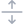
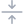

# wuijs-lib

Library version: `0.2.0`

Document version: `0.2.0.20250830.1-e` (e: in edition, c: complete)

Licence: `Apache License 2.0`

Author: `Sergio E. Belmar V. <sbelmar@1640lab.com>`

## Index

*   [Overview](#overview)
	*   [Classes Table](#classes-table)
*   [Install](#install)
*   [Implementation](#implementation)
*   [Classes](#classes)
    *   [WUICookie](#wuiCookie)
	*   [WUIHead](#wuiHead)
	*   [WUIBody](#wuiBody)
	*   [WUILanguage](#wuiLanguage)
	*   [WUIScrolly](#wuiScrolly)
	*   [WUIIcon](#wuiIcon)
	*   [WUIFade](#wuiFade)
	*   WUITooltip
	*   WUILoader
	*   WUIModal
	*   WUIModalSelector
	*   WUISlider
	*   WUIPaging
	*   WUITabs
	*   WUIList
	*   WUITable
	*   WUIForm
	*   WUIFormat
	*   WUISelectpicker
	*   WUIDatepicker
	*   WUITimepicker
	*   WUIColorpicker
	*   WUICheckbox
	*   WUIIntensity
	*   WUIButton

<a name="overview"></a>

## Overview

WUI, an acronym for *Web User Interface JavaScript library*, is an open source JavaScript library for the rapid implementation of Web user interfaces composed of 25 classes, which can be used independently or together.

<a name="classes-table"></a>

### Classes Table

| Class            | Version | Description |
| ---------------- | -------:| ----------- |
| WUICookie        | `0.1`   | Cookie manager. |
| WUIHead          | `0.1`   | HTML header manager. |
| WUIBody          | `0.1`   | HTML body manager. Allows the import of CSS/JS/HTML content and facilitates implementation in native mobile environments. |
| WUILanguage      | `0.2`   | Language manager for web interfaces. Allows you to load language files in JS or JSON format and dynamically update the content of HTML elements based on the language. |
| WUIScrolly       | `0.1`   | Tool for animating HTML elements using the "onscroll" event of the HTML page body. |
| WUIIcon          | `0.1`   | Set of pre-designed icons loaded via CSS, for use in interfaces. |
| WUIFade          | `0.1`   | Tool for fading out and fading in HTML elements with opacity. |
| WUITooltip       | `0.1`   | Simple object for hover text. |
| WUILoader        | `0.1`   | Simple object for loading animation. |
| WUIModal         | `0.1`   | Composite object for implementing dialog boxes (type `message`) and pop-up windows (type `page`). |
| WUIModalSelector | `0.1`   | Extended object of `WUIModal` for implementing selection lists based on arrays or data inputs of type `<select>`. |
| WUISlider        | `0.1`   | Composite object for implementing mouse-controlled and/or event-controlled blinds. |
| WUIPaging        | `0.1`   | Composite object for implementing paginated views. |
| WUITabs          | `0.1`   | Composite object for implementing views accessible by tab selection. |
| WUIList          | `0.1`   | Composite object for implementing data lists and buttons for each row optionally. |
| WUITable         | `0.1`   | Composite object for implementing data tables. Unlike the `WUIList` object, the `WUITable` object includes a column header. |
| WUIForm          | `0.1`   | Composite object for implementing data forms. This object allows the implementation of HTML data input elements such as `<input>`, `<select>`, and `<textarea>`, and WUI library objects such as `WUISelectpicker`, `WUIDatepicker`, `WUITimepicker`, `WUIColorpicker`, `WUICheckbox`, `WUIIntensity`, and `WUIButton`. |
| WUIFormat        | `0.1`   | Tool for managing and validating `string`, `number` and `Date` data formats. |
| WUISelectpicker  | `0.1`   | Composite object for implementing multiple-select or exclusive data entries based on lists based on HTML `<select>` elements. |
| WUIDatepicker    | `0.1`   | Composite object for implementing date type data input. |
| WUITimepicker    | `0.1`   | Composite object for implementing time type data inputs. |
| WUIColorpicker   | `0.1`   | Composite object for implementing color picker type data inputs. |
| WUICheckbox      | `0.1`   | Composite object for implementing checkbox type data inputs. |
| WUIIntensity     | `0.1`   | Composite object for implementing 4-level intensity selector type data inputs: none, low, half, and high. |
| WUIButton        | `0.1`   | Composite object for button implementation. |

<a name="install"></a>

## Install

To install the WUI library, you must clone it from the official distribution repositories en GitHib (`1640lab/wuijs-lib` or `sbelmar/wuijs-lib`). Assuming the project where it will be deployed has a download directory: `./downloads`, a `./src` source directory, and within that, a `./src/Libraries` library directory, you must type the following in the terminal:

```bash
cd ./downloads
git clone https://git@github.com/1640lab/wuijs-lib.git
cp -r ./wuijs-lib/src/WDS ../src/Libraries/
```

<a name="implementation"></a>

## Implementation

To enable all classes, the CSS and JS dependencies of the libraries must be implemented in the HTML header of the web page together with the `Settings.css` and `WUI.css` style configuration files.

CSS code in the `Settings.css` file:

```css
/* Main settings */

:root {
	--app-light1color: #f6f6fa;
	--app-light2color: #fdfdfe;
	--app-dark1color: #3b404a;
	--app-dark2color: #353a40;
	--app-dark3color: #1f2429;
	--app-dark4color: #3c4d5a;
	--app-dark5color: #2f3c48;
	--app-primarycolor: #f4a261;
	--app-hightlightcolor: #1e90ff;
	--app-warningcolor: #f44343;
	--app-disabledcolor: #d5dce3;
	--app-softcolor: #353a401a;
	--app-titlefont: "SanFrancisco";
}
```

CSS code in the `WUI.css` file:

```css
/* WUI settings */

:root {

	/* wui-loader */

	--wui-loader-color: var(--app-light1color);

	/* wui-scrolly */

	--wui-scrolly-paging-bgcolor: var(--app-light1color);

	/* wui-icon */

	--wui-icon-size: 24px;
	--wui-icon-smallsize: 14px;
	--wui-icon-bgcolor-out: rgb(from var(--app-dark5color) r g b / 70%);
	--wui-icon-bgcolor-over: var(--app-dark5color);

	/* wui-tooltip */

	--wui-tooltip-open-delay: .2s;
	--wui-tooltip-bgcolor: var(--app-dark3color);
	--wui-tooltip-textcolor: #fff;

	/* wui-modal */

	--max-modal-width: 380px;
	--wui-modal-bgcolor: rgba(1, 2, 3, .2); /* rgba required */
	--wui-modal-bgcolor-under: rgba(1, 2, 3, 0);
	--wui-modal-box-radius: 17px;
	--wui-modal-box-bgcolor: rgb(from var(--app-light1color) r g b / 95%);
	--wui-modal-back-textcolor: var(--app-hightlightcolor);
	--wui-modal-topbar-height: 4px;
	--wui-modal-title-textfont: var(--app-titlefont);
	--wui-modal-title-textcase: none;
	--wui-modal-title-textcolor: #000;
	--wui-modal-body-scroll-bgcolor-out: rgb(from var(--app-dark5color) r g b / 20%);
	--wui-modal-body-scroll-bgcolor-over: rgb(from var(--app-dark5color) r g b / 40%);
	--wui-modal-footer-bordercolor: transparent;
	--wui-modal-message-box-width: 280px;
	--wui-modal-message-box-bgcolor: rgba(255, 255, 255, .8);
	--wui-modal-message-box-textcolor: var(--app-dark4color);
	--wui-modal-message-mobile-box-width: 280px;
	--wui-modal-message-mobile-footer-bordercolor: var(--app-softcolor);
	--wui-modal-message-mobile-button-bordercolor: var(--app-softcolor);
	--wui-modal-message-linkcolor: var(--app-hightlightcolor);
	--wui-modal-page-box-width: 800px;
	--wui-modal-page-box-height: 90%;
	--wui-modal-page-box-radius: 10px;
	--wui-modal-page-box-maxheight: 640px;
	--wui-modal-page-box-bgcolor: rgb(from var(--app-light1color) r g b / 95%);
	--wui-modal-page-header-topbar-bgcolor: rgb(from var(--app-dark1color) r g b / 20%);
	--wui-modal-page-header-bordercolor: var(--app-softcolor);
	--wui-modal-slidepage-box-margin: 10px;
	--wui-modal-smallpage-box-width: 340px;
	--wui-modal-smallpage-box-height: 280px;
	--max-modal-mobile-width: 430px;

	/* wui-modal select */

	--wui-modal-select-box-width: 280px;
	--wui-modal-select-box-bgcolor: rgba(255, 255, 255, .8);
	--wui-modal-select-option-bordercolor-out: var(--app-softcolor);
	--wui-modal-select-option-bordercolor-over: var(--app-softcolor);
	--wui-modal-select-option-bgcolor-out: transparent;
	--wui-modal-select-option-bgcolor-over: rgb(from var(--app-dark1color) r g b / 4%);
	--wui-modal-select-option-iconcolor-out: var(--app-hightlightcolor);
	--wui-modal-select-option-iconcolor-over: var(--app-hightlightcolor);
	--wui-modal-select-option-iconcolor-disabled: rgb(112, 128, 144, .4);
	--wui-modal-select-option-textcolor-out: var(--app-dark4color);
	--wui-modal-select-option-textcolor-over: var(--app-hightlightcolor);
	--wui-modal-select-option-textcolor-selected: var(--app-hightlightcolor);
	--wui-modal-select-option-textcolor-disabled: rgb(112, 128, 144, .4);
	--wui-modal-select-option-checker-bordercolor-out: var(--app-hightlightcolor);
	--wui-modal-select-option-checker-bordercolor-selected: var(--app-hightlightcolor);
	--wui-modal-select-option-checker-bgcolor-out: transparent;
	--wui-modal-select-option-checker-bgcolor-selected: var(--app-hightlightcolor);
	--wui-modal-select-button-bordercolor: var(--app-softcolor);

	/* wui-slider */

	--wui-slider-dots-bgcolor: transparent;
	--wui-slider-dot-bgcolor: rgba(255, 255, 255, .6);
	--wui-slider-dot-bgcolor-elected: rgba(255, 255, 255, .9);

	/* wui-paging */

	--wui-paging-page-transition-time: .4s;
	--wui-paging-page-bgcolor: transparent;
	--wui-paging-page-scroll-bgcolor-out: rgb(from var(--app-dark4color) r g b / 20%);
	--wui-paging-page-scroll-bgcolor-over: rgb(from var(--app-dark4color) r g b / 40%);

	/* wui-tabs */

	--wui-tabs-tab-bgcolor-out: var(--app-light2color);
	--wui-tabs-tab-bgcolor-over: var(--app-light1color);
	--wui-tabs-tab-iconcolor-out: var(--app-hightlightcolor);
	--wui-tabs-tab-iconcolor-over: var(--app-hightlightcolor);
	--wui-tabs-tab-iconcolor-mobile: var(--app-hightlightcolor);
	--wui-tabs-tab-textcolor-out: var(--app-dark4color);
	--wui-tabs-tab-textcolor-over: var(--app-hightlightcolor);

	/* wui-list */

	--wui-list-radius: 10px;
	--wui-list-borderwidth: 0;
	--wui-list-bordercolor: var(--app-softcolor);
	--wui-list-scroll-bgcolor-out: rgb(from var(--app-dark4color) r g b / 20%);
	--wui-list-scroll-bgcolor-over: rgb(from var(--app-dark4color) r g b / 40%);
	--wui-list-row-height: 44px;
	--wui-list-row-borderwidth: 1px;
	--wui-list-row-bordercolor-out: var(--app-softcolor);
	--wui-list-row-bordercolor-over: var(--app-softcolor);
	--wui-list-row-bgcolor-out: var(--app-light2color);
	--wui-list-row-bgcolor-over: var(--app-light1color);
	--wui-list-row-textcolor-out: var(--app-dark4color);
	--wui-list-row-textcolor-over: var(--app-dark4color);
	--wui-list-row-textcolor-disabled: var(--app-disabledcolor);
	--wui-list-innerrow-borderwidth: 1px;
	--wui-list-innerrow-bordercolor: rgb(from var(--app-dark2color) r g b / 10%);
	--wui-list-innerrow-bgcolor: var(--app-light1color);
	--wui-list-innerrow-textcolor: rgb(from var(--app-dark4color) r g b / 60%);
	--wui-list-buttons-bgcolor: transparent;
	--wui-list-button-size: 48px; /* 34px */
	--wui-list-button-hmargin: 8px;
	--wui-list-button-radius: 50%;
	--wui-list-button-bgcolor-enabled: var(--app-hightlightcolor);
	--wui-list-button-bgcolor-disabled: var(--app-disabledcolor);
	--wui-list-message-textcolor: var(--app-dark4color);
	--max-list-width: 600px;
	--max-list-mobile-width: 430px;

	/* wui-table */

	--wui-table-column-bordercolor-width: 1px;
	--wui-table-column-bordercolor-out: rgb(from var(--app-hightlightcolor) r g b / 10%);
	--wui-table-column-bordercolor-over: rgba(255, 255, 255, .8);
	--wui-table-column-bordercolor-selected: rgba(255, 255, 255, .8);
	--wui-table-column-bgcolor-out: transparent;
	--wui-table-column-bgcolor-over: transparent;
	--wui-table-column-bgcolor-selectd: var(--app-hightlightcolor);
	--wui-table-column-textcolor-out: #444;
	--wui-table-column-textcolor-over: #000;
	--wui-table-column-textcolor-disabled: var(--app-disabledcolor);
	--wui-table-row-radius: 10px;
	--wui-table-row-bordercolor-width: 1px;
	--wui-table-row-bordercolor-out: rgb(from var(--app-hightlightcolor) r g b / 10%);
	--wui-table-row-bordercolor-over: rgba(255, 255, 255, .8);
	--wui-table-row-bordercolor-selected: rgba(255, 255, 255, .8);
	--wui-table-row-bgcolor-out: transparent;
	--wui-table-row-bgcolor-over: transparent;
	--wui-table-row-bgcolor-selectd: var(--app-hightlightcolor);
	--wui-table-row-textcolor-out: var(--app-dark1color);
	--wui-table-row-textcolor-over: var(--app-dark3color);
	--wui-table-row-textcolor-disabled: var(--app-disabledcolor);
	--wui-table-row-textcolor-selected: #fff;

	/* wui-form */

	--wui-form-header-bordercolor: var(--app-softcolor);
	--wui-form-body-scroll-bgcolor-out: rgb(from var(--app-dark5color) r g b / 20%);
	--wui-form-body-scroll-bgcolor-over: rgb(from var(--app-dark5color) r g b / 40%);
	--wui-form-line-bgcolor: rgba(204, 204, 204, .4);
	--wui-form-fieldset-bgcolor: #fff;
	--wui-form-legend-texttransform: uppercase;
	--wui-form-legend-textcolor: rgb(from var(--app-dark4color) r g b / 60%);
	--wui-form-label-textcolor-out: var(--app-dark4color);
	--wui-form-label-textcolor-focus: var(--app-hightlightcolor);
	--wui-form-label-textcolor-notempty: rgb(from var(--app-dark4color) r g b / 40%);
	--wui-form-label-textcolor-disabled: var(--app-disabledcolor);
	--wui-form-input-height: 30px;
	--wui-form-input-borderwidth: 1px;
	--wui-form-input-borderradius: 15px;
	--wui-form-input-bordercolor-out: rgb(from var(--app-hightlightcolor) r g b / 20%);
	--wui-form-input-bordercolor-focus: var(--app-hightlightcolor);
	--wui-form-input-bordercolor-invalid: var(--app-warningcolor);
	--wui-form-input-bordercolor-disabled: var(--app-disabledcolor);
	--wui-form-input-bgcolor-out: rgb(from var(--app-hightlightcolor) r g b / 4%);
	--wui-form-input-bgcolor-focus: rgb(from var(--app-hightlightcolor) r g b / 4%);
	--wui-form-input-bgcolor-disabled: var(--app-disabledcolor);
	--wui-form-input-textcolor-out: #000;
	--wui-form-input-textcolor-disabled: var(--app-disabledcolor);
	--wui-form-date-openicon-src: none;
	--wui-form-date-openicon-size: 30px;
	--wui-form-date-opencolor-out: #000;
	--wui-form-date-opencolor-over: var(--app-hightlightcolor);
	--wui-form-date-opencolor-focus: var(--app-hightlightcolor);
	--wui-form-date-opencolor-disabled: var(--app-disabledcolor);
	--wui-form-time-openicon-src: none;
	--wui-form-time-openicon-size: 30px;
	--wui-form-time-opencolor-out: #000;
	--wui-form-time-opencolor-over: var(--app-hightlightcolor);
	--wui-form-time-opencolor-focus: var(--app-hightlightcolor);
	--wui-form-time-opencolor-disabled: var(--app-disabledcolor);
	--wui-form-time-textcolor-out: var(--app-hightlightcolor);
	--wui-form-time-textcolor-disabled: var(--app-disabledcolor);
	--wui-form-range-thumb-size: 20px;
	--wui-form-range-thumb-bgcolor-out: var(--app-hightlightcolor);
	--wui-form-range-thumb-bgcolor-over: var(--app-hightlightcolor);
	--wui-form-range-thumb-bgcolor-disabled: var(--app-disabledcolor);
	--wui-form-range-trackbar-height: 7px;
	--wui-form-range-trackbar-borderwidth: 1px;
	--wui-form-range-trackbar-bordercolor: var(--app-softcolor);
	--wui-form-range-trackbar-bgcolor-out: rgb(from var(--app-dark1color) r g b / 4%);
	--wui-form-range-trackbar-bgcolor-over: var(--app-hightlightcolor);
	--wui-form-range-trackbar-bgcolor-disabled: var(--app-disabledcolor);
	--wui-form-select-openicon-src: none;
	--wui-form-select-openicon-size: 30px;
	--wui-form-select-opencolor-out: #000;
	--wui-form-select-opencolor-over: var(--app-hightlightcolor);
	--wui-form-select-opencolor-focus: var(--app-hightlightcolor);
	--wui-form-select-opencolor-disabled: var(--app-disabledcolor);
	--wui-form-data-textcolor-out: var(--app-hightlightcolor);
	--wui-form-data-textcolor-disabled: var(--app-disabledcolor);
	--wui-form-progress-borderwidth: 1px;
	--wui-form-progress-bordercolor: rgb(from var(--app-hightlightcolor) r g b / 20%);
	--wui-form-progress-valuecolor: var(--app-hightlightcolor);
	--wui-form-progress-bgcolor: var(--app-softcolor);
	--wui-form-text-textcolor-out: #888;
	--wui-form-text-textcolor-disabled: var(--app-disabledcolor);
	--wui-form-text-linkcolor-out: var(--app-hightlightcolor);
	--wui-form-text-linkcolor-highlight: var(--app-hightlightcolor);
	--wui-form-message-bgcolor: rgba(255, 255, 255, .6);
	--wui-form-message-textcolor: #888;
	--wui-form-message-highlight-bgcolor: var(--app-hightlightcolor);
	--wui-form-message-highlight-textcolor: #fff;
	--wui-form-mobile-field-bordercolor: rgb(from var(--app-hightlightcolor) r g b / 10%);
	--wui-form-mobile-label-textcolor: #444;
	--wui-form-mobile-input-height: 40px;
	--wui-form-mobile-input-bgcolor: rgb(from var(--app-hightlightcolor) r g b / 4%);
	--wui-form-mobile-input-height: 34px;
	--wui-form-mobile-input-borderradius: 17px;

	/* wui-selectpicker */

	--wui-selectpicker-openicon-src: none;
	--wui-selectpicker-openicon-size: var(--wui-form-select-openicon-src);
	--wui-selectpicker-opencolor-out: var(--wui-form-select-opencolor-out);
	--wui-selectpicker-opencolor-over: var(--wui-form-select-opencolor-over);
	--wui-selectpicker-opencolor-focus: var(--wui-form-select-opencolor-focus);
	--wui-selectpicker-opencolor-disabled: var(--wui-form-select-opencolor-disabled);
	--wui-selectpicker-input-textcolor-out: var(--wui-form-input-textcolor-out);
	--wui-selectpicker-input-textcolor-over: var(--wui-form-input-textcolor-over);
	--wui-selectpicker-input-textcolor-disabled: var(--wui-form-input-textcolor-disabled);
	--wui-selectpicker-box-radius: 10px;
	--wui-selectpicker-box-bordercolor: var(--app-softcolor);
	--wui-selectpicker-box-bgcolor: rgba(255, 255, 255, .8);
	--wui-selectpicker-box-option-bordercolor-out: var(--app-softcolor);
	--wui-selectpicker-box-option-bordercolor-over: var(--app-softcolor);
	--wui-selectpicker-box-option-bgcolor-out: transparent;
	--wui-selectpicker-box-option-bgcolor-over: rgb(from var(--app-dark4color) r g b / 4%);
	--wui-selectpicker-box-option-checkicon-src: none;
	--wui-selectpicker-box-option-checkcolor-out: var(--app-hightlightcolor);
	--wui-selectpicker-box-option-checkcolor-over: var(--app-hightlightcolor);
	--wui-selectpicker-box-option-checkcolor-selected: var(--app-hightlightcolor);
	--wui-selectpicker-box-option-checkcolor-disabled: rgb(112, 128, 144, .4);
	--wui-selectpicker-box-option-textcolor-out: var(--app-dark4color);
	--wui-selectpicker-box-option-textcolor-empty: rgb(from var(--app-dark4color) r g b / 60%);
	--wui-selectpicker-box-option-textcolor-over: var(--app-dark4color);
	--wui-selectpicker-box-option-textcolor-selected: var(--app-hightlightcolor);
	--wui-selectpicker-box-option-textcolor-disabled: rgb(112, 128, 144, .4);
	--wui-selectpicker-box-button-bordercolor: var(--app-softcolor);
	--wui-selectpicker-box-button-textcolor-out: var(--app-hightlightcolor);
	--wui-selectpicker-box-button-textcolor-over: var(--app-hightlightcolor);
	--wui-selectpicker-mobile-bgcolor: rgba(1, 2, 3, .2);
	--wui-selectpicker-mobile-box-width: var(--wui-modal-select-box-width);
	--wui-selectpicker-mobile-box-radius: var(--wui-modal-box-radius);

	/* wui-datepicker */

	--wui-datepicker-openicon-src: none;
	--wui-datepicker-openicon-size: var(--wui-form-select-openicon-src);
	--wui-datepicker-opencolor-out: var(--wui-form-select-opencolor-out);
	--wui-datepicker-opencolor-over: var(--wui-form-select-opencolor-over);
	--wui-datepicker-opencolor-focus: var(--wui-form-select-opencolor-focus);
	--wui-datepicker-opencolor-disabled: var(--wui-form-select-opencolor-disabled);
	--wui-datepicker-box-radius: 10px;
	--wui-datepicker-box-bordercolor: var(--app-softcolor);
	--wui-datepicker-box-bgcolor: rgba(255, 255, 255, .8);
	--wui-datepicker-box-upicon-src: none;
	--wui-datepicker-box-upcolor-out: #000;
	--wui-datepicker-box-upcolor-over: var(--app-hightlightcolor);
	--wui-datepicker-box-upcolor-disabled: var(--app-disabledcolor);
	--wui-datepicker-box-downicon-src: none;
	--wui-datepicker-box-downcolor-out: #000;
	--wui-datepicker-box-downcolor-over: var(--app-hightlightcolor);
	--wui-datepicker-box-downcolor-disabled: var(--app-disabledcolor);
	--wui-datepicker-box-previcon-src: none;
	--wui-datepicker-box-prevcolor-out: var(--app-hightlightcolor);
	--wui-datepicker-box-prevcolor-over: var(--app-hightlightcolor);
	--wui-datepicker-box-prevcolor-disabled: var(--app-disabledcolor);
	--wui-datepicker-box-nexticon-src: none;
	--wui-datepicker-box-nextcolor-out: var(--app-hightlightcolor);
	--wui-datepicker-box-nextcolor-over: var(--app-hightlightcolor);
	--wui-datepicker-box-nextcolor-disabled: var(--app-disabledcolor);
	--wui-datepicker-box-month-titlecolor: #888;
	--wui-datepicker-box-month-bgcolor-today: var(--app-softcolor);
	--wui-datepicker-box-month-bgcolor-over: rgb(from var(--app-hightlightcolor) r g b / 20%);
	--wui-datepicker-box-month-bgcolor-selected: var(--app-hightlightcolor);
	--wui-datepicker-box-month-textcolor-out: #000;
	--wui-datepicker-box-month-textcolor-over: var(--app-hightlightcolor);
	--wui-datepicker-box-month-textcolor-selected: #fff;
	--wui-datepicker-box-day-bgcolor-today: var(--app-softcolor);
	--wui-datepicker-box-day-bgcolor-over: rgb(from var(--app-hightlightcolor) r g b / 20%);
	--wui-datepicker-box-day-bgcolor-selected: var(--app-hightlightcolor);
	--wui-datepicker-box-day-textcolor-out: #000;
	--wui-datepicker-box-day-textcolor-over: var(--app-hightlightcolor);
	--wui-datepicker-box-day-textcolor-selected: #fff;
	--wui-datepicker-box-button-textcolor-out: var(--app-hightlightcolor);
	--wui-datepicker-box-button-textcolor-over: var(--app-hightlightcolor);
	--wui-datepicker-mobile-bgcolor: rgba(1, 2, 3, .2);

	/* wui-timepicker */

	--wui-timepicker-openicon-src: none;
	--wui-timepicker-openicon-size: var(--wui-form-select-openicon-src);
	--wui-timepicker-opencolor-out: var(--wui-form-select-opencolor-out);
	--wui-timepicker-opencolor-over: var(--wui-form-select-opencolor-over);
	--wui-timepicker-opencolor-focus: var(--wui-form-select-opencolor-focus);
	--wui-timepicker-opencolor-disabled: var(--wui-form-select-opencolor-disabled);
	--wui-timepicker-box-radius: 10px;
	--wui-timepicker-box-bordercolor: var(--app-softcolor);
	--wui-timepicker-box-bgcolor: rgba(255, 255, 255, .8);
	--wui-timepicker-box-option-bgcolor-now: var(--app-softcolor);
	--wui-timepicker-box-option-bgcolor-over: rgb(from var(--app-hightlightcolor) r g b / 20%);
	--wui-timepicker-box-option-bgcolor-selected: var(--app-hightlightcolor);
	--wui-timepicker-box-option-textcolor-out: #000;
	--wui-timepicker-box-option-textcolor-over: var(--app-hightlightcolor);
	--wui-timepicker-box-option-textcolor-selected: #fff;
	--wui-timepicker-box-button-textcolor-out: var(--app-hightlightcolor);
	--wui-timepicker-box-button-textcolor-over: var(--app-hightlightcolor);
	--wui-timepicker-mobile-bgcolor: rgba(1, 2, 3, .2);

	/* wui-colorpicker */

	--wui-colorpicker-button-size: 30px;
	--wui-colorpicker-button-bordercolor-out: rgb(from var(--app-hightlightcolor) r g b / 20%);
	--wui-colorpicker-button-bordercolor-over: var(--app-hightlightcolor);
	--wui-colorpicker-button-bordercolor-invalid: var(--app-warningcolor);
	--wui-colorpicker-button-bordercolor-disabled: var(--app-disabledcolor);
	--wui-colorpicker-button-bgcolor-out: transparent;
	--wui-colorpicker-button-bgcolor-over: transparent;
	--wui-colorpicker-button-bgcolor-disabled: transparent;
	--wui-colorpicker-viewicon-borderwidth: 1px;
	--wui-colorpicker-viewicon-bordercolor: rgb(from var(--app-hightlightcolor) r g b / 20%);
	--wui-colorpicker-openicon-src: none;
	--wui-colorpicker-openicon-size: var(--wui-form-select-pickericon-size);
	--wui-colorpicker-opencolor-out: var(--wui-form-select-opencolor-out);
	--wui-colorpicker-opencolor-over: var(--wui-form-select-opencolor-over);
	--wui-colorpicker-opencolor-focus: var(--wui-form-select-opencolor-focus);
	--wui-colorpicker-opencolor-disabled: var(--wui-form-select-opencolor-disabled);
	--wui-colorpicker-emptyicon-src: none;
	--wui-colorpicker-emptycolor-out: var(--app-dark1color);
	--wui-colorpicker-box-radius: 10px;
	--wui-colorpicker-box-bordercolor: var(--app-softcolor);
	--wui-colorpicker-box-bgcolor: rgba(255, 255, 255, .8);
	--wui-colorpicker-box-tab-textcolor-out: var(--app-dark1color);
	--wui-colorpicker-box-tab-textcolor-selected: var(--app-hightlightcolor);
	--wui-colorpicker-box-option-bordercolor-out: var(--app-softcolor);
	--wui-colorpicker-box-option-bordercolor-over: var(--app-softcolor);
	--wui-colorpicker-box-option-bgcolor-out: transparent;
	--wui-colorpicker-box-option-bgcolor-over: rgb(from var(--app-dark1color) r g b / 4%);
	--wui-colorpicker-box-option-bgcolor-selected: var(--app-hightlightcolor);
	--wui-colorpicker-box-option-textcolor-out: #000;
	--wui-colorpicker-box-option-textcolor-over: var(--app-hightlightcolor);
	--wui-colorpicker-box-option-textcolor-selected: #fff;
	--wui-colorpicker-box-preview-textcolor-out: #000;
	--wui-colorpicker-box-preview-textcolor-empty: rgb(from var(--app-dark1color) r g b / 70%);
	--wui-colorpicker-box-button-textcolor-out: var(--app-hightlightcolor);
	--wui-colorpicker-box-button-textcolor-over: var(--app-hightlightcolor);
	--wui-colorpicker-mobile-bgcolor: rgba(1, 2, 3, .2);

	/* wui-checkbox */

	--wui-checkbox-button-size: 30px;
	--wui-checkbox-bordercolor-out: rgb(from var(--app-hightlightcolor) r g b / 20%);
	--wui-checkbox-bordercolor-over: var(--app-hightlightcolor);
	--wui-checkbox-bordercolor-checked: var(--app-hightlightcolor);
	--wui-checkbox-bordercolor-invalid: var(--app-warningcolor);
	--wui-checkbox-bordercolor-disabled: var(--app-disabledcolor);
	--wui-checkbox-bgcolor-out: rgb(from var(--app-hightlightcolor) r g b / 4%);
	--wui-checkbox-bgcolor-over: rgb(from var(--app-hightlightcolor) r g b / 4%);
	--wui-checkbox-bgcolor-checked: var(--app-hightlightcolor);
	--wui-checkbox-bgcolor-disabled: rgb(from var(--app-disabledcolor) r g b / 20%);
	--wui-checkbox-button-bordercolor-out: rgb(from var(--app-hightlightcolor) r g b / 20%);
	--wui-checkbox-button-bordercolor-over: var(--app-hightlightcolor);
	--wui-checkbox-button-bordercolor-checked: var(--app-hightlightcolor);
	--wui-checkbox-button-bordercolor-disabled: var(--app-disabledcolor);
	--wui-checkbox-button-bgcolor-out: var(--app-light1color);
	--wui-checkbox-button-bgcolor-over: rgb(from var(--app-hightlightcolor) r g b / 4%);
	--wui-checkbox-button-bgcolor-checked: var(--app-light1color);
	--wui-checkbox-button-bgcolor-disabled: var(--app-disabledcolor);

	/* wui-intensity */

	--wui-intensity-height: 30px;
	--wui-intensity-radius: 15px;
	--wui-intensity-bordercolor-out: rgb(from var(--app-hightlightcolor) r g b / 20%);
	--wui-intensity-bordercolor-disabled: var(--app-disabledcolor);
	--wui-intensity-bgcolor-none: var(--app-light2color);
	--wui-intensity-bgcolor-low: mediumaquamarine;
	--wui-intensity-bgcolor-half: darkorange;
	--wui-intensity-bgcolor-high: orangered;

	/* wui-button */

	--wui-button-default-minwidth: 200px;
	--wui-button-default-height: 34px;
	--wui-button-default-bordercolor-out: rgb(from var(--app-dark1color) r g b / 15%);
	--wui-button-default-bordercolor-over: var(--app-hightlightcolor);
	--wui-button-default-bordercolor-selected: var(--app-hightlightcolor);
	--wui-button-default-bordercolor-disabled: var(--app-disabledcolor);
	--wui-button-default-bgcolor-out: transparent;
	--wui-button-default-bgcolor-over: transparent;
	--wui-button-default-bgcolor-selected: var(--app-hightlightcolor);
	--wui-button-default-bgcolor-disabled: transparent;
	--wui-button-default-textcolor-out: var(--app-hightlightcolor);
	--wui-button-default-textcolor-over: var(--app-hightlightcolor);
	--wui-button-default-textcolor-selected: #fff;
	--wui-button-default-textcolor-disabled: var(--app-disabledcolor);
	--wui-button-default-textsize: 15px;
	--wui-button-submit-minwidth: 200px;
	--wui-button-submit-height: 34px;
	--wui-button-submit-bordercolor-out: rgb(from var(--app-hightlightcolor) r g b / 20%);
	--wui-button-submit-bordercolor-over: var(--app-hightlightcolor);
	--wui-button-submit-bordercolor-selected: var(--app-hightlightcolor);
	--wui-button-submit-bordercolor-disabled: var(--wui-button-default-bordercolor-disabled);
	--wui-button-submit-bgcolor-out: var(--app-hightlightcolor);
	--wui-button-submit-bgcolor-over: var(--app-hightlightcolor);
	--wui-button-submit-bgcolor-selected: var(--app-hightlightcolor);
	--wui-button-submit-bgcolor-disabled: var(--app-disabledcolor);
	--wui-button-submit-textcolor-out: #fff;
	--wui-button-submit-textcolor-over: #fff;
	--wui-button-submit-textcolor-mobile: var(--app-hightlightcolor);
	--wui-button-submit-textcolor-selected: #fff;
	--wui-button-submit-textcolor-disabled: var(--wui-disabledcolor);
	--wui-button-submit-textsize: 15px;
	--wui-button-warning-bordercolor-out: rgb(from var(--app-warningcolor) r g b / 25%);
	--wui-button-warning-bordercolor-over: var(--app-warningcolor);
	--wui-button-warning-bordercolor-selected: var(--app-warningcolor);
	--wui-button-warning-bordercolor-disabled: var(--wui-button-default-bordercolor-disabled);
	--wui-button-warning-bgcolor-out: var(--app-warningcolor);
	--wui-button-warning-bgcolor-over: var(--app-warningcolor);
	--wui-button-warning-bgcolor-selected: var(--app-warningcolor);
	--wui-button-warning-bgcolor-disabled: var(--app-disabledcolor);
	--wui-button-warning-textcolor-out: #fff;
	--wui-button-warning-textcolor-over: #fff;
	--wui-button-warning-textcolor-mobile: var(--app-warningcolor);
	--wui-button-warning-textcolor-selected: #fff;
	--wui-button-warning-textcolor-disabled: var(--wui-disabledcolor);
	--wui-button-icon-float-padding: 5px;
	--wui-button-mobile-default-height: 40px;
	--wui-button-mobile-submit-height: 40px;
	--wui-button-mobile-icon-float-padding: 10px;
	--wui-button-form-default-minwidth: 100px;
}
```

Assuming the CSS configuration file is installed in the relative path `./Settings/WUI.css` and the libraries are installed in the relative path `./Libraries/WUI`, the HTML header looks like this:

HTML code:

```html
<!doctype html>
<html>
	<head>
		<title></title>
		<meta charset="utf-8">
		<meta name="viewport" content="width=device-width, initial-scale=1, maximum-scale=1, viewport-fit=cover">
		<meta name="application-name" content="">
		<meta name="theme-color" content="">
		<link type="text/css" rel="stylesheet" href="./Settings/Main.css">
		<link type="text/css" rel="stylesheet" href="./Settings/WUI.css">
		<link type="text/css" rel="stylesheet" href="./Libraries/WUI/Scrolly/WUIScrolly-0.1.css">
		<link type="text/css" rel="stylesheet" href="./Libraries/WUI/Icon/WUIIcon-0.1.css">
		<link type="text/css" rel="stylesheet" href="./Libraries/WUI/Tooltip/WUITooltip-0.1.css">
		<link type="text/css" rel="stylesheet" href="./Libraries/WUI/Loader/WUILoader-0.1.css">
		<link type="text/css" rel="stylesheet" href="./Libraries/WUI/Modal/WUIModal-0.1.css">
		<link type="text/css" rel="stylesheet" href="./Libraries/WUI/Modal/WUIModalSelect-0.1.css">
		<link type="text/css" rel="stylesheet" href="./Libraries/WUI/Slider/WUISlider-0.1.css">
		<link type="text/css" rel="stylesheet" href="./Libraries/WUI/Paging/WUIPaging-0.1.css">
		<link type="text/css" rel="stylesheet" href="./Libraries/WUI/Tabs/WUITabs-0.1.css">
		<link type="text/css" rel="stylesheet" href="./Libraries/WUI/List/WUIList-0.1.css">
		<link type="text/css" rel="stylesheet" href="./Libraries/WUI/Table/WUITable-0.1.css">
		<link type="text/css" rel="stylesheet" href="./Libraries/WUI/Form/WUIForm-0.1.css">
		<link type="text/css" rel="stylesheet" href="./Libraries/WUI/Selectpicker/WUISelectpicker-0.1.css">
		<link type="text/css" rel="stylesheet" href="./Libraries/WUI/Datepicker/WUIDatepicker-0.1.css">
		<link type="text/css" rel="stylesheet" href="./Libraries/WUI/Timepicker/WUITimepicker-0.1.css">
		<link type="text/css" rel="stylesheet" href="./Libraries/WUI/Colorpicker/WUIColorpicker-0.1.css">
		<link type="text/css" rel="stylesheet" href="./Libraries/WUI/Checkbox/WUICheckbox-0.1.css">
		<link type="text/css" rel="stylesheet" href="./Libraries/WUI/Intensity/WUIIntensity-0.1.css">
		<link type="text/css" rel="stylesheet" href="./Libraries/WUI/Button/WUIButton-0.1.css">
		<script type="text/javascript" src="./Libraries/WUI/Cookie/WUICookie-0.1.js"></script>
		<script type="text/javascript" src="./Libraries/WUI/Head/WUIHead-0.1.js"></script>
		<script type="text/javascript" src="./Libraries/WUI/Language/WUILanguage-0.2.js"></script>
		<script type="text/javascript" src="./Libraries/WUI/Body/WUIBody-0.1.js"></script>
		<script type="text/javascript" src="./Libraries/WUI/Scrolly/WUIScrolly-0.1.js"></script>
		<script type="text/javascript" src="./Libraries/WUI/Fade/WUIFade-0.1.js"></script>
		<script type="text/javascript" src="./Libraries/WUI/Tooltip/WUITooltip-0.1.js"></script>
		<script type="text/javascript" src="./Libraries/WUI/Loader/WUILoader-0.1.js"></script>
		<script type="text/javascript" src="./Libraries/WUI/Modal/WUIModal-0.1.js"></script>
		<script type="text/javascript" src="./Libraries/WUI/Modal/WUIModalSelect-0.1.js"></script>
		<script type="text/javascript" src="./Libraries/WUI/Slider/WUISlider-0.1.js"></script>
		<script type="text/javascript" src="./Libraries/WUI/Paging/WUIPaging-0.1.js"></script>
		<script type="text/javascript" src="./Libraries/WUI/Tabs/WUITabs-0.1.js"></script>
		<script type="text/javascript" src="./Libraries/WUI/List/WUIList-0.1.js"></script>
		<script type="text/javascript" src="./Libraries/WUI/Table/WUITable-0.1.js"></script>
		<script type="text/javascript" src="./Libraries/WUI/Form/WUIForm-0.1.js"></script>
		<script type="text/javascript" src="./Libraries/WUI/Format/WUIFormat-0.1.js"></script>
		<script type="text/javascript" src="./Libraries/WUI/Selectpicker/WUISelectpicker-0.1.js"></script>
		<script type="text/javascript" src="./Libraries/WUI/Datepicker/WUIDatepicker-0.1.js"></script>
		<script type="text/javascript" src="./Libraries/WUI/Timepicker/WUITimepicker-0.1.js"></script>
		<script type="text/javascript" src="./Libraries/WUI/Colorpicker/WUIColorpicker-0.1.js"></script>
		<script type="text/javascript" src="./Libraries/WUI/Checkbox/WUICheckbox-0.1.js"></script>
		<script type="text/javascript" src="./Libraries/WUI/Intensity/WUIIntensity-0.1.js"></script>
		<script type="text/javascript" src="./Libraries/WUI/Button/WUIButton-0.1.js"></script>
	</head>
	<body>
	</body>
</html>
```

This implementation method allows for standardization of an application's user interface design, using the `WUI.css` file.

> [!IMPORTANT]
> The style configuration files must be in the paths `./Settings/Main.css` and `./Settings/WUI.css`.

> [!TIP]
> If you only want to implement part of the WUI library set, you must add calls to the JS and CSS files in the HTML header as indicated in each section.
> On the other hand, the `WUI.css` file will only require the definition of the objects you want to implement.

<a name="classes"></a>

## Classes

<a name="wuiCookie"></a>

### WUICookie

Version: `0.1`

Cookie manager.

#### Constructor

| Type      | Description |
| --------- | ----------- |
| WUICookie | `WUICookie([properties])`<br><br>Arguments:<br>**• properties:** `object` |

#### Properties

| Property | Type      | Default value       | Description |
| -------- | --------- | ------------------- | ----------- |
| domain   | `string`  | `location.hostname` | Defines the domain for which the cookie is accessible. By default, it's the current host. Setting it to a parent domain (e.g., example.com for sub.example.com) makes it accessible to subdomains. |
| path     | `string`  | `"./"`              | Specifies the path for which the cookie is valid. The default value is the current path, with an empty value being equivalent to this. Setting "/" makes the cookie accessible across the entire domain. |
| minutes  | `number`  | `525600`            | Specifies the duration, measured in minutes, for the cookie to remain active. The default value is 365 days or one year.
| overssl  | `boolean` | `false`             | If set to `true`, the cookie will only be sent over HTTPS connections. |

#### Methods

| Method    | Return type | Description |
| --------- | ----------- | ----------- |
| set       | `void`      | `set(name, value[, options])`<br><br>Arguments:<br>**• name:** `string` <br>**• value:** `string` <br>**• options:** `object` *optional*<br><br>Add or modify a cookie. |
| get       | `string`    | `get(name)`<br><br>Arguments:<br>**• name:** `string`<br><br>Reads the contents of a cookie by its name. |

#### Implementation

HTML head:

```html
<script type="text/javascript" src="./Libraries/WUI/Cookie/WUICookie-0.1.js"></script>
```

JS code:

```js
// Create WUICookie object
const cookie = new WUICookie({
	domain: location.hostname,
	path: "./",
	minutes: 365*24*60,
	overssl: false
});

// Save cookie
cookie.set("test", "value");

// Read cookie
console.log(cookie.get("test"));
```

<a name="wuiHead"></a>

### WUIHead

Version: `0.1`

HTML header manager.

#### Constructor

| Type    | Description |
| ------- | ----------- |
| WUIHead | `WUIHead()` |

#### Properties

Class without properties.

#### Methods

| Method             | Return type | Description |
| ------------------ | ----------- | ----------- |
| setTitle           | `void`      | `setTitle(name)`<br><br>Arguments:<br>**• name:** `string`<br><br>Sets the name of the HTML document using the `<title>` tag. |
| setMetaContent     | `void`      | `setMetaContent(name, content)`<br><br>Arguments:<br>**• name:** `string` <br>**• content:** `string`<br><br>Sets a meta value in the header of the HTML document using the `<meta>` tag.<br>Check specifications and compatibility in [MDN Web Docs](https://developer.mozilla.org/en-US/docs/Web/HTML/Reference/Elements/meta/name). |
| setApplicationName | `void`      | `setApplicationName(content)`<br>Alias of `setMetaContent("application-name", content)`<br><br>Arguments:<br>**• content:** `string`<br><br>Sets the `application-name` meta value in the header of the HTML document. |
| setThemeColor      | `void`      | `setThemeColor(content)`<br>Alias of `setMetaContent("theme-color", content)`<br><br>Arguments:<br>**• content:** `string`<br><br>Sets the `theme-color` meta value in the header of the HTML document.<br>Check specifications and compatibility in [MDN Web Docs](https://developer.mozilla.org/en-US/docs/Web/HTML/Reference/Elements/meta/name/theme-color). |
| refresh            | `void`      | `refresh()`<br><br>Reloads JS and CSS files called from the `<head>` section of the HTML document, by appending a dynamic get parameter. |

#### Implementation

HTML head:

```html
<title></title>
<meta name="application-name" content="">
<meta name="theme-color" content="">
<script type="text/javascript" src="./Libraries/WUI/Head/WUIHead-0.1.js"></script>
```

JS code:

```js
// Create WUIHead object
const head = new WUIHead();

// Change page title
head.setTitle("Test title");

// Change application name metadata
head.setApplicationName("Test app");

// Change the metadata of the browser's top bar color
head.setThemeColor("#1e90ff");
```

<a name="wuiBody"></a>

### WUIBody

Version: `0.1`

HTML body manager. Allows the import of CSS/JS/HTML content and facilitates implementation in native mobile environments.

#### Constructor

| Type    | Description |
| ------- | ----------- |
| WUIBody | `WUIBody([properties])`<br><br>Arguments:<br>**• properties:** `object` |

#### Properties

| Property        | Type       | Default value | Description |
| --------------- | ---------- | ------------- | ----------- |
| environment     | `string`   | `"web"`       | Web interface deployment environment.<br><br>Values:<br>• `"web"`<br>• `"native.android"`<br>• `"native.ios"` |
| importDirectory | `string`   | `""`          | Relative path of the directory where the subdirectories for content import are hosted. |
| importMode      | `string`   | `"fetch"`     | Content retrieval method for upload.<br><br>Values:<br>• `"fetch"`<br>• `"xhr"`<br><br>When deploying to native environments using WebView for Android or WebKit for iOS, it is recommended to use `"xhr"`. |
| onCompleted     | `function` | `null`        | Function that is called when all content is imported and loaded into the body of the HTML page. |
| debug           | `boolean`  | `false`       | Test mode. Prints imported content to the console when the property value is `true`. |

#### Methods

| Method  | Return type | Description |
| ------- | ----------- | ----------- |
| import  | `void`      | `import(id, path[, done])`<br><br>Arguments:<br>**• id:** `string`, specifies the id of the HTML element where the content is to be loaded.<br>**• path:** `string`, specifies the subdirectory path and filename of the files with extension `.css`, `.htm` and `.js` that will be imported and loaded.<br>**• done:** `function` *optional*, this function is executed when the content loading has finished.<br><br>Imports CSS/JS/HTML content referenced to an HTML element by its `id`. |
| prepare | `void`      | `prepare()`<br><br>Depending on the value of the `environment` parameter, modifies the HTML elements `a`, `input`, and `select` in the HTML document body to adapt them to native environments. |
| openURL | `void`      | `openURL(url[, download])`<br><br>Arguments:<br><br>**• id:** `string`, specifies the URL that is required to be opened or downloaded.<br>**• download:** `string` *optional*, specifies the name of the file that will be used to download the content referenced by the URL.<br><br>Open or download content using a URL. This method is required in native environments since WebView on Android or WebKit on iOS aren't always supported. |

#### Implementation

HTML head:

```html
<script type="text/javascript" src="./Libraries/WUI/Body/WUIBody-0.1.js"></script>
```

CSS content of the `./Imports/test-content.css` file:

```css
.test a, .test a:visited {
	text-decoration: none;
	font-size: 20px;
	color: blue;
}
```

HTML content of the `./Imports/test-content.htm` file:

```html
<section id="testContent" class="test">
	<a href="https://www.google.com">Google!</a>
</section>
```

JS content of the `./Imports/test-content.js` file:

```js
const testContentLog = (content) => {
	console.log(content);
}
```

HTML code:

```html
<section id="testContent"></section>
```

JS code:

```js
// Create WUIBody object
const body = new WUIBody({
	onCompleted: () => {
		body.prepare();
	}
});

// Import CSS/HTML/JS content from the ./Imports directory
body.import("testContent", "./Imports/test-content", () => {
	testContentLog("test content loaded");
});
```

<a name="wuiLanguage"></a>

### WUILanguage

Version: `0.2`

Language manager for web interfaces. Allows you to load language files in JS or JSON format and dynamically update the content of HTML elements based on the language.

#### Constructor

| Type        | Description |
| ----------- | ----------- |
| WUILanguage | `WUILanguage([properties])`<br><br>Arguments:<br>**• properties:** `object` *optional* |

#### Properties

| Property   | Type       | Default value     | Description |
| ---------- | ---------- | ----------------- | ----------- |
| selector   | `string`   | `".wui-language"` | CSS selector for HTML elements to be loaded. This can be applied to the `content` attribute of the `meta` element, to the `innerHTML` property of the elements: `h1`, `h2`, `h3`, `h4`, `h5`, `h6`, `div`, `span`, `p`, `i`, `li`, `a`, `legend`, `label`, `option`, `data`, `button`, and to the `placeholder` attribute of the `input` and `textarea` elements. |
| directory  | `string`   | `"Languages/"`    | Path to the directory where the language files are located. |
| sets       | `array`    | `["main"]`        | List of language set names to load. |
| lang       | `string`   | `"es"`            | Language code in ISO 639-1 format. |
| mode       | `string`   | `"js"`            | Language file format.<br><br>Values:<br>• `"js"`<br>• `"json"` |
| dataKey    | `string`   | `"key"`           | Name of the `data-*` attribute that contains the text key in HTML elements. |
| dataOutput | `string`   | `"text"`          | Name of the `data-*` attribute where the loaded text can be placed. |
| onLoad     | `function` | `null`            | Function that is called when the language loading has finished. |

#### Methods

| Method | Return type | Description |
| ------ | ----------- | ----------- |
| load   | `void`      | `load([lang[, sets]])`<br><br>Arguments:<br>**• lang:** `string` *optional* (default value the current language)<br>**• sets:** `array` *optional* (default value the current set expressed as an array)<br><br>Loads the language files indicated by language and set, and updates the HTML elements marked with the CSS selector. |

#### Implementation

HTML head:

```html
<script type="text/javascript" src="./Libraries/WUI/Language/WUILanguage-0.2.js"></script>
```

JS code file `main-en.js`:

```js
return {
	titles: {
		test: "Test title"
	},
	texts: {
		test: "Test text"
	}
};
```

> [!IMPORTANT]
> If `js` is used as the format for language files, said file must be initialized by the `return` keyword followed by a `{}` object.

JSON code file `main-en.json`:

```json
{
	"titles": {
		"test": "Test title"
	},
	"texts": {
		"test": "Test text"
	}
}
```

HTML code:

```html
<h1 class="wui-language" data-key="titles.test"></h1>
<div class="wui-language" data-key="texts.test"></div>
```

JS code:

```js
// Create WUILanguage object
const language = new WUILanguage({
    selector: ".wui-language",
    directory: "./Languages/",
    sets: ["main"],
    lang: "en",
    mode: "js",
    dataKey: "key",
    dataOutput: "text",
    onLoad: (...args) => {
		[lang, languages] = args;
        console.log("Language loaded:", lang, languages);
    }
});

// Declaring global variables
let lang = language.lang;
let languages = {};

// Load content from the main-en.js file
language.load(); // Option 1
language.load("en"); // Option 2 (equivalent to option 1)
language.load("en", ["main"]); // Option 3 (equivalent to option 1)
```

> [!IMPORTANT]
> The language file must be in the path `./Languages/main-en.js` or `./Languages/main-en.json` depending on the set, language and mode used. It is important that language files are in the form `{set}-{lang}.{mode}`, otherwise the file cannot be imported.

It is possible to combine sets of files from the same language, for example, if you have a `main-es.js` file and another `main2-es.js` file that complements the first, they can be called simultaneously using the `sets` property.

JS code:

```js
// Option 1: Update the sets property and then reload.
language.sets = ["main", "main2"];
language.load(); 

// Option 2: Reload by passing the combination of sets as a parameter.
language.load("en", ["main", "main2"]);
```

> [!TIP]
> If you want to add dynamic content within a text, It is recommended to use the `js` language file format (`mode: "js"`) and add the text using the string interpolation method, also known as template literals. I.e. ``mykey: `My ${var} text` ``.

<a name="wuiScrolly"></a>

### WUIScrolly

Versión: `0.1`

Tool for animating HTML elements using the "onscroll" event of the HTML page body.

#### Constructor

| Type       | Description |
| ---------- | ----------- |
| WUIScrolly | `WUIScrolly([properties])`<br><br>Arguments:<br>**• properties:** `object` *optional* |

#### Properties

| Property    | Type       | Default value | Description |
| ----------- | ---------- | ------------- | ----------- |
| sections    | `array`    | `[]`          | List of objects with the configuration of the sections that will be incorporated into the animation, as defined in **Section Properties**. |
| behavior    | `string`   | `"smooth"`    | Behavior for moving focus to the body of the HTML page.<br><br>Values:<br>• `"auto"`<br>• `"smooth"` |
| dataScrollY | `string`   | `"scrollY"`   | Name of the `data-*` attribute of the main document element (`<html>` / `document.documentElement`) that contains the numeric value measured in pixels of the total vertical scrolling of the HTML page, where `0` represents the top of the document (or no movement). |
| dataDelay   | `string`   | `"delay"`     | Name of the `data-*` attribute that determines the time, measured in milliseconds, that it takes for an HTML element animated using CSS styles to animate once it is given focus. |
| onStart     | `function` | `null`        | Function that is called when the scroll movement starts, either through the `scroll` events for the mouse or `touchmove` for the touch screen. |
| onMove      | `function` | `null`        | Function that is called when the scroll movement is executed, either through the `scroll` events for the mouse or `touchmove` for the touch screen. |
| onStop      | `function` | `null`        | Function that is called when the scroll movement ends, either through the `scroll` events for the mouse or `touchmove` for the touch screen. |
| debug       | `boolean`  | `false`       | Test mode. Prints to the console the `selector` and `height` values ​​of the scenes added in the startup instance, and `scrollY`, `y`, `index`, `sceneIndex`, `step`, `sceneStep`, and `progress` when they change. Enabled when the property value is `true`. |

#### Section Properties

| Property  | Type       | Default value | Description |
| --------- | ---------- | ------------- | ----------- |
| selector  | `string`   | `undefined`   | CSS selector that defines the HTML element to be included as a section. If more than one element matches the selector, only the first match will be included. *oblogatory* |
| target    | `string`   | `undefined`   | Auxiliary name for referencing the section. Used in the `goSection()` method. |
| type      | `string`   | `"auto"`      | Defines the CSS behavior of the section height.<br><br>Values:<br>• `"auto"`<br>• `"static"` |
| height    | `number`   | `undefined`   | Defines the height of the section, this can be expressed as a number associated with pixels or in a CSS compatible format. |
| steps     | `number`   | `undefined`   | Total number of steps defined in the `animation` animation function. |
| pages     | `number`   | `undefined`   | Total number of pages defined in the `animation` animation function. |
| animation | `function` | `undefined`   | `function(step, progress)`<br><br>Arguments:<br>**• step:** `number`, value between `0` and `pages - 1` <br>**• progress:** `number`, value between `0` and `1` <br><br>Function that is called when the scroll movement is executed in a section. |

#### Methods

| Method     | Return type | Description |
| ---------- | ----------- | ----------- |
| init       | `void`      | `init()`<br><br>Initializes the object once the sections you want to animate have been added. |
| stop       | `void`      | `stop()`<br><br>Interrupts the animation in its execution cycle. |
| addSection | `void`      | `addSection({section_properties})`<br><br>Adds a new section configuration to the object's section list, as defined in **Section Properties:**. |
| goSection  | `void`      | `goSection(target[, done[, behavior]])`<br><br>Arguments:<br>**• target:** `string` <br>**• done:** `function` <br>**• behavior:** `string` <br><br>Moves the focus of the HTML page to the section specified by the `target` parameter. |
| selectPage | `void`      | `selectPage(sectionIndex, pageIndex)`<br><br>Arguments:<br>**• sectionIndex:** `number`, values ​​from `0` <br>**• pageIndex:** `number`, value between `0` and `pages - 1` <br><br>Moves the focus of the HTML page to the section specified by the `sectionIndex` parameter and advances to the `pageIndex` page in that section. |
| drawCenter | `void`      | `drawCenter()`<br><br>Draws the center of the visible part of the HTML page in the browser. |
| drawRuler  | `void`      | `drawRuler()`<br><br>Draws a vertical ruler with pixel measurements, on the left side of the HTML page. |

#### Estilos CSS para Animación

| Style         | Description |
| ------------- | ----------- |
| .fadein       | Enter and exits with opacity without movement. |
| .fadein-up    | Enter and exits with opacity from above. |
| .fadein-left  | Enter and exit with opacity from the left. |
| .fadein-right | Enter and exit with opacity from the right. |

#### Implementation

There are two ways to implement the animation library, the simplest is through CSS animation tags, the second is through programming JS animation functions that are loaded in specific sections of the HTML page.

HTML head:

```html
<link type="text/css" rel="stylesheet" href="./Libraries/WUI/Scrolly/WUIScrolly-0.1.css">
<script type="text/javascript" src="./Libraries/WUI/Scrolly/WUIScrolly-0.1.js"></script>
```

CSS code:

```css
.my-section {
	width: 100%;
	margin: 10px 0;
	background-color: lightgray;
}
.my-element {
	width: 50px;
	height: 50px;
	pargin: 20px;
	background-color: dodgerblue;
}
```

HTML code:

```html
<!-- CSS animation -->
<section id="section1" class="my-section">
	<div class="my-element fadein-left"></div>
	<div class="my-element fadein-top" data-delay="200"></div>
	<div class="my-element fadein-right" data-delay="400"></div>
</section>

<!-- JS animation -->
<section id="section2" class="my-section">
	<div class="scene">
		<div class="animation"></div>
	</div>
</section>

<!-- JS animation with pagination -->
<section id="section3" class="my-section">
	<div class="scene">
		<div class="animation"></div>
	</div>
	<div class="paging dots"></div>
</section>
```

JS code:

```js
// Create WUIScrolly object
const scrolly = new WUIScrolly({
	behavior: "smooth",
	dataScrollY: "scrollY",
	dataDelay: "delay",
	onStart: null,
	onMove: null,
	onStop: null,
	debug: true
});

// Add sections with JS animation
scrolly.addSection({
	selector: "#section2"
});
scrolly.addSection({
	selector: "#section3"
});

// Initialize object
scrolly.init();
```

<a name="wuiIcon"></a>

### WUIIcon

Versión: `0.1`

Set of pre-designed icons loaded via CSS, for use in interfaces.

#### Signals Icon Table

| Icon                                             | Style                                                     | Icon                                             | Style                                                     | Icon                                         | Style                                                         | Icon                                         | Style                                                          |
| :---:                                            | -----                                                     | :---:                                            | -----                                                     | :---:                                        | -----                                                         | :---:                                        | -----                                                          |
|                 | .plus-line                                                |              | .plus-lg-line                                             |             | .dash-line                                                    |          | .dash-lg-line                                                  |
|                | .check-line<br>.successful-line                           |             | .check-lg-line<br>.successful-lg-line                     |             | .info-line                                                    |          | .info-lg-line                                                  |
|             | .question-line                                            |          | .question-lg-line                                         |       | .excamation-line<br>.warning-line                             |    | .excamation-lg-line<br>.warning-lg-line                        |
|                | .slash-line                                               |             | .slash-lg-line                                            |                | .x-line<br>.close-line<br>.error-line                         |             | .x-lg-line<br>.close-lg-line<br>.error-lg-line                 |
|               | .filter-line                                              |            | .filter-lg-line                                           |      | .plus-circle-line                                             |      | .plus-circle-fill                                              |
|          | .dash-circle-line                                         |          | .dash-circle-fill                                         |     | .check-circle-line<br>.successful-circle-line                 |     | .check-circle-fill<br>.successful-circle-fill                  |
|          | .info-circle-line                                         |          | .info-circle-fill                                         |  | .question-circle-line                                         |  | .question-circle-fill                                          |
|    | .excamation-circle-line<br>.warning-circle-line           |    | .excamation-circle-fill<br>.warning-circle-fill           |     | .slash-circle-line                                            |     | .slash-circle-fill                                             |
|             | .x-circle-line<br>.close-circle-line<br>error-circle-line |             | .x-circle-fill<br>.close-circle-fill<br>error-circle-fill |    | .filter-circle-line                                           |    | .filter-circle-fill                                            |
|  | .excamation-triangle-line<br>.warning-triangle-line       |  | .excamation-triangle-fill<br>.warning-triangle-fill       |        | .x-octagon-line<br>.close-octagon-line<br>.error-octagon-line |        | ..x-octagon-fill<br>.close-octagon-fill<br>.error-octagon-fill |

#### Arrow Icon Table

| Icon                                                  | Style                          | Icon                                                | Style                        | Icon                                                    | Style                            | Icon                                                  | Style                          |
| :--:                                                  | -----                          | :--:                                                | -----                        | :--:                                                    | -----                            | :--:                                                  | -----                          |
|                  | .arrow-up-line                 |              | .arrow-left-line             |                 | .arrow-right-line                |                | .arrow-down-line               |
|               | .arrow-up-lg-line              |           | .arrow-left-lg-line          |              | .arrow-right-lg-line             |             | .arrow-down-lg-line            |
|           | .arrow-upleft-lg-line          |        | .arrow-upright-lg-line       |           | .arrow-downleft-lg-line          |        | .arrow-downright-lg-line       |
|              | .arrowhead-up-line             |          | .arrowhead-left-line         |             | .arrowhead-right-line            |            | .arrowhead-down-line           |
|           | .arrowhead-up-lg-line          |       | .arrowhead-left-lg-line      |          | .arrowhead-right-lg-line         |         | .arrowhead-down-lg-line        |
|          | .arrowhead-up-stg-line         |      | .arrowhead-left-stg-line     |         | .arrowhead-right-stg-line        |        | .arrowhead-down-stg-line       |
|              | .arrowhead-up-fill             |          | .arrowhead-left-fill         |             | .arrowhead-right-fill            |            | .arrowhead-down-fill           |
|           | .arrow-up-circle-line          |       | .arrow-left-circle-line      |          | .arrow-right-circle-line         |         | .arrow-down-circle-line        |
|       | .arrow-upleft-circle-line      |    | .arrow-upright-circle-line   |       | .arrow-downleft-circle-line      |    | .arrow-downright-circle-line   |
|           | .arrow-up-circle-fill          |       | .arrow-left-circle-fill      |          | .arrow-right-circle-fill         |         | .arrow-down-circle-fill        |
|       | .arrow-upleft-circle-fill      |    | .arrow-upright-circle-fill   |       | .arrow-downleft-circle-fill      |    | .arrow-downright-circle-fill   |
|               | .arrowbar-up-line              |           | .arrowbar-left-line          |              | .arrowbar-right-line             |             | .arrowbar-down-line            |
|  | .arrows-expand-horizontal-line |  | .arrows-expand-vertical-line |  | .arrows-collapse-horizontal-line |  | .arrows-collapse-vertical-line |
|         | .arrows-horizontal-line        |         | .arrows-vertical-line        |      | .arrows-expand-diagonal-line     |  | .arrows-collapse-diagonal-line |
|           | .arrowbox-out-up-line          |       | .arrowbox-out-left-line      |          | .arrowbox-out-right-line         |         | .arrowbox-out-down-line        |
|       | .arrowbox-out-upleft-line      |    | .arrowbox-out-upright-line   |       | .arrowbox-out-downleft-line      |    | .arrowbox-out-downright-line   |
|            | .arrowbox-in-up-line           |        | .arrowbox-in-left-line       |           | .arrowbox-in-right-line          |          | .arrowbox-in-down-line         |
|        | .arrowbox-in-upleft-line       |     | .arrowbox-in-upright-line    |        | .arrowbox-in-downleft-line       |     | .arrowbox-in-downright-line    |

#### Number Icon Table

| Icon                                     | Style             | Icon                                     | Style             | Icon                                     | Style             | Icon                                     | Style             |
| :--:                                     | -----             | :--:                                     | -----             | :--:                                     | -----             | :--:                                     | -----             |
|  | .num0-circle-line |  | .num0-circle-fill |  | .num1-circle-line |  | .num1-circle-fill |
|  | .num2-circle-line |  | .num2-circle-fill |  | .num3-circle-line |  | .num3-circle-fill |
|  | .num4-circle-line |  | .num4-circle-fill |  | .num5-circle-line |  | .num5-circle-fill |
|  | .num6-circle-line |  | .num6-circle-fill |  | .num7-circle-line |  | .num7-circle-fill |
|  | .num8-circle-line |  | .num8-circle-fill |  | .num9-circle-line |  | .num9-circle-fill |

#### Person Icon Table

| Icon                                       | Style               | Icon                                       | Style               | Icon                                        | Style                | Icon                                        | Style                |
| :--:                                       | -----               | :--:                                       | -----               | :--:                                        | -----                | :--:                                        | -----                |
|            | .man-fill           |          | .woman-fill         |          | .person-line         |          | .person-fill         |
|    | .person-plus-line   |    | .person-plus-fill   |     | .person-dash-line    |     | .person-dash-fill    |
|   | .person-check-line  |   | .person-check-fill  |        | .person-x-line       |        | .person-x-fill       |
|         | .people-line        |         | .people-fill        |  | .person-contact-line |  | .person-contact-fill |
|    | .person-card-line   |    | .person-card-fill   |    | .person-names-line   |    | .person-names-fill   |
|  | .person-circle-line |  | .person-circle-fill |            | .user-line           |                                                     |                      |

#### File Icon Table

| Icon                                      | Style              | Icon                                      | Style              | Icon                                       | Style               | Icon                                       | Style               |
| :--:                                      | -----              | :--:                                      | -----              | :--:                                       | -----               | :--:                                       | -----               |
|  | .folder-close-line |  | .folder-close-fill |    | .folder-open-line   |    | .folder-open-fill   |
|          | .file-line         |          | .file-fill         |  | .file-barchart-line |  | .file-barchart-fill |
|    | .file-check-line   |    | .file-check-fill   |       | .file-pdf-line      |       | .file-pdf-fill      |
|    | .file-image-line    |   | .file-image-fill   |      | .file-text-line     |      | .file-text-fill     |
|   | .file-upload-line  |   | .file-upload-fill  |       | .file-zip-line      |       | .file-zip-fill      |

#### Control Icon Table

| Icon                                         | Style                 | Icon                                         | Style                 | Icon                                        | Style                | Icon                                        | Style                |
| :--:                                         | -----                 | :--:                                         | -----                 | :--:                                        | -----                | :--:                                        | -----                |
|         | .calendar-line        |         | .calendar-fill        |    | .calendar-day-line   |    | .calendar-day-fill   |
|    | .calendar-week-line   |    | .calendar-week-fill   |  | .calendar-range-line |  | .calendar-range-fill |
|  | .clipboard-check-line |  | .clipboard-check-fill |  | .clipboard-data-line |  | .clipboard-data-fill |
|         | .bookmark-line        |         | .bookmark-fill        |       | .bookmarks-line      |       | .bookmarks-fill      |
|   | .bookmark-check-line  |   | .bookmark-check-fill  |      | .bookmark-x-line     |      | .bookmark-x-fill     |

#### Protection Icons Table

| Icon                                        | Style              | Icon                                      | Style              | Icon                                        | Style                | Icon                                        | Style                |
| :--:                                        | -----              | :--:                                      | -----              | :--:                                        | -----                | :--:                                        | -----                |
|    | .shield-check-line |  | .shield-check-fill |     | .shield-lock-line    |     | .shield-lock-fill    |
|     | .patch-check-line  |   | .patch-check-fill  |  | .patch-question-line |  | .patch-question-fill |

#### Communication Icons Table

| Icon                                         | Style                 | Icon                                         | Style                 | Icon                                        | Style                | Icon                                        | Style                |
| :--:                                         | -----                 | :--:                                         | -----                 | :--:                                        | -----                | :--:                                        | -----                |
|            | .phone-line           |            | .phone-fill           |       | .phonebook-line      |       | .phonebook-fill      |
|       | .mail-close-line      |       | .mail-close-fill      |       | .chat-dots-line      |       | .chat-dots-fill      |
|  | .chat-left-quote-line |  | .chat-left-quote-fill |  | .chat-left-text-line |  | .chat-left-text-fill |
|    | .emoji-neutral-line   |    | .emoji-neutral-fill   |     | .emoji-smile-line    |     | .emoji-smile-fill    |
|      | .emoji-frown-line     |      | .emoji-frown-fill     |  | .emoji-surprise-line |  | .emoji-surprise-fill |

#### Cloud Icon Table

| Icon                                      | Style              | Icon                                      | Style              | Icon                                        | Style                | Icon                                        | Style                |
| :--:                                      | -----              | :--:                                      | -----              | :--:                                        | -----                | :--:                                        | -----                |
|         | .cloud-line        |         | .cloud-fill        |     | .cloud-slash-line    |     | .cloud-slash-fill    |
|  | .cloud-upload-line |  | .cloud-upload-fill |  | .cloud-download-line |  | .cloud-download-fill |

#### Map Icon Table

| Icon                                       | Style               | Icon                                         | Style                 | Icon                                    | Style            |
| :--:                                       | -----               | :--:                                         | -----                 | :--:                                    | -----            |
|            | .map-line           |              | .map-fill             |                                                 |                  |
|        | .map-alt-line       |          | .map-alt-fill         |                                                 |                  |
|      | .mapmarker-line     |        | .mapmarker-fill       |  | .mapmarker-color |
|         | .mappin-line        |           | .mappin-fill          |     | .mappin-color    |
|     | .mappointer-line    |       | .mappointer-fill      |                                                 |                  |
|       | .mapchart-line      |         | .mapchart-fill        |                                                 |                  |
|          | .globe-line         |        | .globe-alt-line       |                                                 |                  |
|  | .globe-america-fill |     | .globe-africa-fill    |                                                 |                  |
|     | .globe-asia-fill    |  | .globe-australia-fill |                                                 |                  |
|       | .h-circle-line      |         | .h-circle-fill        |                                                 |                  |
|     | .highway-66-fill    |       | .highway-75-fill      |  | .highway-94-fill |

#### Device Icon Table

| Icon                                     | Style             | Icon                                     | Style             | Icon                                  | Style          | Icon                                    | Style            |
| :--:                                     | -----             | :--:                                     | -----             | :--:                                  | -----          | :--:                                    | -----            |
|      | .devices-line     |       | .laptop-line      |    | .mobile-line   |  | .mobile-alt-line |
|  | .mobile-apps-line |  | .mobile-apps-fill |  | .computer-line |      | .camera-fill     |

#### Brand Icon Table

| Icon                                 | Style         | Icon                               | Style       | Icon                                | Style        |
| :--:                                 | -----         | :--:                               | -----       | :--:                                | -----        |
|  | .android-fill |  | .apple-fill |  | .huawei-fill |

#### Apps Icons Table

| Icon                                       | Style               | Icon                                          | Style                  | Icon                                      | Style              | Icon                                       | Style               |
| :--:                                       | -----               | :--:                                          | -----                  | :--:                                      | -----              | :--:                                       | -----               |
|            | .app-line           |  | .app-notification-line |       | .acrobat-fill      |       | .acrobat-color      |      
|      | .applemail-fill     |        | .applemail-color       |      | .appstore-fill     |      | .appstore-color     |  
|   | .appstore-alt-fill  |     | .appstore-alt-color    |        | .bcardy-fill       |        | .bcardy-color       |  
|        | .behance-fill       |          | .behance-color         |      | .facebook-fill     |      | .facebook-color     |  
|   | .facebook-alt-fill  |     | .facebook-alt-color    |        | .github-fill       |        | .github-color       |  
|          | .gmail-fill         |            | .gmail-color           |    | .googlemaps-fill   |    | .googlemaps-color   |  
|     | .googleplay-fill    |       | .googleplay-color      |     | .instagram-fill    |     | .instagram-color    |  
|  | .instagram-alt-fill |    | .instagram-alt-color   |          | .line-fill         |          | .line-color         |  
|       | .line-alt-fill      |         | .line-alt-color        |      | .linkedin-fill     |      | .linkedin-color     |  
|   | .linkedin-alt-fill  |     | .linkedin-alt-color    |     | .messenger-fill    |     | .messenger-color    |   
|        | .outlook-fill       |          | .outlook-color         |  | .samsungemail-fill |  | .samsungemail-color |
|          | .skype-fill         |            | .skype-color           |      | .telegram-fill     |      | .telegram-color     |
|   | .telegram-alt-fill  |     | .telegram-alt-color    |        | .tiktok-fill       |        | .tiktok-color       |
|        | .twitter-fill       |          | .twitter-color         |   | .twitter-alt-fill  |   | .twitter-alt-color  |
|      | .twitter-x-fill     |        | .twitter-x-color       |         | .vimeo-fill        |         | .vimeo-color        |
|      | .vimeo-alt-fill     |        | .vimeo-alt-color       |         | .yahoo-fill        |         | .yahoo-color        |
|      | .yahoo-alt-fill     |        | .yahoo-alt-color       |       | .youtube-fill      |       | .youtube-color      |
|       | .whatsapp-fill      |         | .whatsapp-color        |  | .whatsapp-alt-fill |  | .whatsapp-alt-color |

#### Options Icon Table

| Icon                                     | Style             | Icon                                     | Style             | Icon                                    | Style            | Icon                                    | Style            |
| :--:                                     | -----             | :--:                                     | -----             | :--:                                    | -----            | :--:                                    | -----            |
|           | .at-line          |        | .at-lg-line       |       | .award-line      |       | .award-fill      |
|       | .basket-line      |       | .basket-fill      |        | .bell-line       |        | .bell-fill       |
|    | .bluetooth-line   |    | .bluetooth-fill   |         | .bug-line        |         | .bug-fill        |
|         | .cash-line        |     | .cash-alt-fill    |      | .circle-line     |      | .circle-fill     |
|     | .contacts-line    |     | .contacts-fill    |   | .copy-link-line  |   | .copy-link-fill  |
|        | .easel-line       |        | .easel-fill       |         | .eye-line        |         | .eye-fill        |
|    | .eye-slash-line   |    | .eye-slash-fill   |        | .flag-line       |        | .flag-fill       |
|       | .floppy-line      |       | .floppy-fill      |        | .gear-line       |        | .gear-fill       |
|        | .gears-line       |        | .gears-fill       |     | .grid3x2-line    |     | .grid3x3-line    |
|       | .health-line      |       | .health-fill      |        | .home-line       |        | .home-fill       |
|        | .image-line       |        | .image-fill       |   | .image-alt-line  |      | .images-line     |
|          | .key-line         |          | .key-fill         |    | .keyboard-line   |    | .keyboard-fill   |
|       | .layers-line      |       | .layers-fill      |   | .lightbulb-line  |   | .lightbulb-fill  |
|         | .lock-line        |         | .lock-fill        |     | .mailbox-line    |     | .mailbox-fill    |
|  | .mortarboard-line |  | .mortarboard-fill |    | .piechart-line   |    | .piechart-fill   |
|      | .palette-line     |      | .palette-fill     |         | .pen-line        |         | .pen-fill        |
|       | .pencil-line      |       | .pencil-fill      |         | .pin-line        |         | .pin-fill        |
|        | .plant-line       |        | .plant-fill       |        | .play-line       |        | .play-fill       |
|  | .play-circle-line |  | .play-circle-fill |        | .send-line       |        | .send-fill       |
|  | .separationh-line |  | .separationv-line |       | .share-line      |       | .share-fill      |
|         | .shop-line        |     | .shop-alt-fill    |    | .signpost-line   |    | .signpost-fill   |
|          | .sim-line         |          | .sim-fill         |        | .star-line       |        | .star-fill       |
|  | .star-circle-line |  | .star-circle-fill |  | .stoplights-line |  | .stoplights-fill |
|         | .time-line        |         | .time-fill        |       | .trash-line      |       | .trash-fill      |
|       | .trophy-line      |       | .trophy-fill      |      | .unlock-line     |      | .unlock-fill     |
|       | .wallet-line      |       | .wallet-fill      |     | .wifi-on-line    |    | .wifi-off-line   |
|   | .window-app-line  |   | .window-app-fill  |      | .zoomin-line     |     | .zoomout-line    |

#### Composer Icon Table

| Icon                                           | Style                   | Icon                                            | Style                    | Icon                                     | Style             | Icon                                      | Style              |
| :--:                                           | -----                   | :--:                                            | -----                    | :--:                                     | -----             | :--:                                      | -----              |
|  | .doublequotes-left-fill |  | .doublequotes-right-fill |  | .indent-left-line |  | .indent-right-line |
|               | .link-line              |            | .link-alt-line           |   | .list-check-line  |   | .list-number-line  |
|         | .list-stars-line        |       | .list-unorderd-line      |     | .textleft-line    |     | .textright-line    |

#### Other Icons Table

| Icon                                       | Style               | Icon                                          | Style                  | Icon                                    | Style            | Icon                                          | Style                  |
| :--:                                       | -----               | :--:                                          | -----                  | :--:                                    | -----            | :--:                                          | -----                  |
|             | .ai-fill            |          | .bullseye-line         |  | .columnsgap-line |              | .dart-fill             |
|      | .datasheet-line     |  | .datasheet-health-line |        | .hash-line       |        | .headphones-line       |
|        | .headset-line       |            | .logout-line           |       | .medal-line      |              | .menu-line             |
|  | .pencil-square-fill |  | .polygon-editable-line |          | .qr-line         |           | .qr-scan-line          |
|          | .quote-fill         |            | .rotate-line           |      | .search-line     |       | .speedometer-line      |
|      | .translate-fill     |               | .web-line              |   | .universal-line  |  | .universal-circle-line |

#### Animated Icons Table

| Icon                                            | Style                    | Icon                                           | Style                   | Icon                                               | Style                       |
| :--:                                            | -----                    | :--:                                           | -----                   | :--:                                               | -----                       |
|  | .animation-loarder-comet |  | .animation-loarder-ring |  | .animation-loarder-ringpath |

#### Implementation

HTML head:

```html
<link type="text/css" rel="stylesheet" href="./Libraries/WUI/Icon/WUIIcon-0.1.css">
```

CSS code:

```css
.my-icon {
	width: 24px;
	height: 24px;
	pargin: 20px;
	background-color: dodgerblue;
}
```

HTML code:

```html
<div class="my-icon wui-icon patch-check-fill"></div>
```

<a name="wuiFade"></a>

### WUIFade

Versión: `0.1`

Tool for fading out and fading in HTML elements with opacity.

#### Constructor

Static class without constructor.

#### Properties

Static class with no object properties.

#### Methods

##### Static methods of the `WUIFade` class:

One way to use the library is by calling static methods directly on the `WUIFade` class:

| Method | Return type | Description |
| -------| ----------- | ----------- |
| in     | `void`      | `in(element[, options])`<br><br>Arguments:<br>**• element:** `HTMLElement` <br>**• options:** `object` *optional*<br><br>Execute the fadein transition. |
| out    | `void`      | `out(element[, options])`<br><br>Arguments:<br>**• element:** `HTMLElement` <br>**• options:** `object` *optional*<br><br>Execute the fadeout transition. |

##### Extended methods of the `HTMLElement` class:

Another alternative way is through extended methods of the `HTMLElement` class through its prototype:

| Method.    | Return type | Description |
| -----------| ----------- | ----------- |
| wuiFadein  | `void`      | `wuiFadein([options])`<br><br>Arguments:<br>**• options:** `object` *optional*<br><br>Execute the fadein transition. |
| wuiFadeout | `void`      | `wuiFadeout([options])`<br><br>Arguments:<br>**• options:** `object` *optional*<br><br>Execute the fadeout transition. |

> [!IMPORTANT]
> Each method call mode is performed on different types of classes, the first is signaled on `WUIFade`, while the second on `HTMLElement`.

##### Options

| Option  | Type      | Default value | Description |
| ------- | --------- | ------------- | ----------- |
| delay   | `number`  | `400`         | Defines the time it will take for the transition effect  in and out, measured in milliseconds. |
| display | `string`  | `"block"`     | Sets the value of the CSS `display` property of the HTML element on which the transition effect is executed, once the incoming transition ends. |
| force   | `boolean` | `false`       | Both the entrance and exit effects are executed as long as the CSS `display` property is different from `options.display` and `none`, respectively. The `force` option ignores this validation. |

#### Implementation

HTML head:

```html
<script type="text/javascript" src="./Libraries/WUI/Fade/WUIFade-0.1.js"></script>
```

CSS code:

```CSS
.my-element {
	display: none;
	width: 24px;
	height: 24px;
	margin: 10px;
	backgroind-color: red;
}
```

HTML code:

```html
<div id="myElement" class="my-element"></div>
```

JS code:
```js
// Element and options definition
const element = document.getElementById("myElement");
const options = {
	display: "block",
	delay: 200
};

// Option 1: WUIFade mode
WUIFade.in(element, options);

// Option 2: HTMLElement mode
element.wuiFadein(options);
```